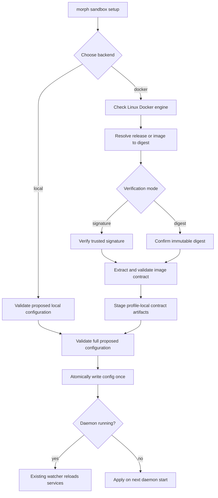

# Sandbox Setup and Contract Management Requirements

## Summary

Morph will provide a guided, scriptable way to configure local or Docker command execution, establish trust in a Docker image, manage the image contract, and safely edit profile configuration. The workflow will prepare and validate the complete change before writing profile configuration once, allowing the existing daemon watcher to reload it in place.

---

## Problem Frame

Docker command execution currently depends on several separately correct artifacts and manual actions: a running Linux Docker engine, an immutable image reference, an image-verification choice, a compatible image contract, and safe execution defaults. The runtime validates much of this, but users must assemble the configuration themselves and discover errors only after trying to execute work.

Contract maintenance has the same problem. The checked-in contract is understandable to contributors, but profile users lack a supported way to create, inspect, customize, validate, or restore their own contract. Editing `config.yaml` directly is also unnecessarily fragile because malformed YAML or invalid values can trigger a failed daemon reload.

The setup experience must reduce this operational burden without weakening the existing trust boundaries. In particular, selecting a signed image must not imply that a locally modified contract is release-authored, and selecting digest verification must not imply that the digest was authenticated by Morph.

---

## Key Decisions

- **One backend-aware setup command.** `morph sandbox setup` owns the setup experience for the currently supported `local` and `docker` backends. Backend-specific behavior remains explicit rather than introducing a plugin framework before a third backend exists.
- **Guided and non-interactive use are peers.** Running setup without sufficient flags starts an interactive flow. Complete flag input produces the same result without prompts and is suitable for scripts and CI.
- **Immutable runtime configuration.** A Docker release or tag is only a selection aid. Active configuration always records an image by digest.
- **Independent image and contract trust.** Image verification answers whether the selected image is trusted. Contract provenance answers where the active contract came from and whether it has been changed. Neither substitutes for the other.
- **Release contract in the image.** An official sandbox image contains its matching contract. Setup extracts and preserves that release contract after verifying the image, then creates a profile-local active copy.
- **Profile-local customization.** Contract edits affect only the selected profile. The original release contract remains available for comparison and reset.
- **User-owned trust in digest mode.** Digest mode accepts the operator's explicit immutable-image choice and does not require Cosign. It does not claim that Morph signed or endorsed the image.
- **External Cosign dependency.** Signature mode uses the user's installed `cosign` executable. Morph never downloads, installs, or updates Cosign.
- **Safe configuration editing.** Both contract editing and general config editing use temporary copies, validate before replacement, detect concurrent changes, and leave the active file untouched on failure.
- **Existing daemon reload behavior.** Setup does not invent a daemon restart API. It writes `config.yaml` once after successful preflight; a running daemon observes the valid change and restarts its services in place.
- **Conservative Docker defaults.** A new Docker setup starts session-scoped, with a private workspace, no network, no mounts, and no injected secrets.
- **Reversible backend switching.** Switching to `local` changes the active backend but retains inactive Docker settings so the user can switch back without rebuilding the configuration.

---

## Actors

- A1. **Profile user** chooses an execution backend, trust mode, image release, contract, and editor-driven changes.
- A2. **Automation caller** performs the same operations through complete flags and consumes stable machine-readable output.
- A3. **Morph CLI** resolves inputs, performs preflight checks, protects active files, and commits valid configuration changes.
- A4. **Docker engine** resolves, pulls, inspects, and runs Linux sandbox images.
- A5. **Image publisher** publishes an official multi-platform image containing its matching contract and, for official releases, signs its immutable digest.
- A6. **Morph daemon** watches profile configuration and reloads valid changes without requiring a separate restart command.

---

## Requirements

**Setup command and interaction**

- R1. Morph provides `morph sandbox setup` as the supported entry point for configuring command-execution backends.
- R2. Setup supports `local` and `docker` in its first release and clearly rejects unknown backends.
- R3. An interactive invocation presents only choices relevant to the selected backend and explains security-sensitive choices before acceptance.
- R4. A non-interactive invocation accepts complete flags for backend, profile, Docker release or image, verification mode, and required trust acceptance without opening prompts.
- R5. Missing or incompatible non-interactive inputs cause a clear failure without changing the profile.
- R6. Setup supports machine-readable output that distinguishes resolved inputs, completed checks, intended changes, warnings, and the final mutation result.
- R7. Repeating setup with an equivalent resolved configuration is idempotent and does not rewrite `config.yaml` or trigger an unnecessary daemon reload.
- R8. Setup reports whether the change is being observed by a running daemon or will apply on the next daemon start; it does not claim to restart the daemon itself.

**Local backend setup**

- R9. Selecting `local` validates the resulting profile configuration without requiring Docker or Cosign.
- R10. Selecting `local` changes only the active execution backend and any settings explicitly supplied by the user; existing Docker image, verification, contract, mount, network, and secret configuration remains preserved but inactive.

**Docker engine and defaults**

- R11. Docker setup detects the configured local Docker endpoint, verifies that it is reachable, and verifies that it can run Linux containers.
- R12. Docker setup fails before profile mutation when the engine is unavailable, incompatible, or exposes permissions that Morph cannot safely use.
- R13. A newly initialized Docker configuration defaults to session scope, private workspace, disabled network access, no host mounts, and no injected secrets.
- R14. Setup displays deviations from those defaults before applying them interactively and includes them explicitly in machine-readable output.
- R15. Docker setup verifies that the selected image platform supports the host architecture and the contract-declared platforms.

**Release and image selection**

- R16. `--release <release>` selects an official sandbox image release and resolves it through the official image repository.
- R17. Release resolution produces an immutable `repository@sha256:...` image reference; a mutable tag is never written as the active image.
- R18. `--image <reference>` supports an explicitly selected custom image and is mutually exclusive with `--release`.
- R19. Custom image references used for activation must resolve to an immutable digest before configuration is written.
- R20. Setup shows both the human-selected release or image and the resolved immutable digest so users can distinguish selection intent from runtime identity.

**Image verification**

- R21. Docker setup supports `signature` and `digest` image-verification modes and defaults official releases to `signature`.
- R22. Signature mode verifies the immutable image reference against Morph's configured trusted signing identity before the image or its embedded contract can become active.
- R23. Signature mode checks for `cosign` on `PATH` before doing work that would otherwise be wasted and provides an actionable installation prerequisite when it is absent.
- R24. Morph never downloads, installs, upgrades, or executes a newly fetched Cosign binary on the user's behalf.
- R25. Digest mode does not invoke or require Cosign; it treats the explicitly accepted digest as the user's trust decision.
- R26. When digest mode resolves `--release` from a mutable tag, interactive setup displays the digest and requires explicit acceptance before mutation.
- R27. A non-interactive digest-mode release setup requires `--accept-digest`; omission fails without mutation.
- R28. Supplying an immutable digest directly through `--image` is itself an explicit digest selection and does not require a second acceptance flag.
- R29. Both verification modes still require image inspection and contract compatibility validation. Digest mode skips signature authentication only.
- R30. Diagnostics report image verification mode and result separately from contract source and modification state.

**Release contract and provenance**

- R31. Every official sandbox image includes the exact contract intended for that release at a stable, documented location inside the image.
- R32. The release workflow ensures that the embedded contract is part of the signed image content and matches the image's platform, runtime user, entry point, helper, paths, and declared executables.
- R33. Setup verifies image trust before extracting or relying on its embedded contract.
- R34. Setup preserves the extracted official contract as an immutable profile artifact identified by image digest and contract digest.
- R35. Setup creates a separate profile-local active contract copy; runtime configuration points to this active copy.
- R36. An unchanged active copy is reported as release-provided. Any content change is reported as user-managed, even when the underlying image remains signature-verified.
- R37. Contract provenance records enough information to show the source image digest, original contract digest, active contract digest, and whether the active contract differs from the release copy.
- R38. Changing the active contract changes the execution security identity so approvals or environments tied to the previous contract cannot silently carry forward.

**Contract lifecycle**

- R39. `morph sandbox contract show` presents the active contract, its provenance, its validation state, and its relationship to the preserved release contract.
- R40. `morph sandbox contract create` creates a contract for a trusted immutable image, derives only facts that can be proven by image inspection, and requires the user to supply or confirm policy-bearing fields that cannot be inferred safely.
- R41. Contract creation refuses to overwrite an active contract unless replacement is explicitly requested and validated.
- R42. `morph sandbox contract edit` opens the active profile contract in the configured editor using the guarded editing flow.
- R43. Contract import or modification supports `--from <file>` and structured flags for automation without requiring an editor.
- R44. `morph sandbox contract validate` supports validation of the active contract and an explicitly supplied candidate file.
- R45. Structural validation checks contract version, supported platforms, runtime identity, required absolute paths, unique executable names, and internal path consistency.
- R46. Image-backed validation checks the candidate against the selected immutable image, including platform, runtime user, entry point, helper, shell, directories, and declared executable paths.
- R47. Image-backed validation authenticates or explicitly accepts the image before using it as evidence and uses a constrained probe that does not grant host mounts, network, or secrets.
- R48. A candidate contract cannot replace the active contract until both structural and required image-backed validation succeed.
- R49. `morph sandbox contract reset` restores a fresh active copy of the preserved contract for the currently selected image after confirmation, without altering the preserved original.
- R50. Contract commands operate on one explicit or resolved profile and never change another profile's active or preserved contracts.

**Guarded config and contract editing**

- R51. `morph config edit` opens the selected profile's `config.yaml` as a general-purpose counterpart to `morph config get` and `morph config set`.
- R52. Editor selection follows an explicit editor option when provided, then `VISUAL`, then `EDITOR`, then a documented platform default; if no usable editor can be resolved, Morph fails without changing the active file.
- R53. Editing occurs on a temporary copy rather than the active file. The active file is replaced only after the editor exits successfully and validation passes.
- R54. Config editing validates YAML syntax, normalization, and the complete Morph configuration contract. Contract editing performs the complete contract validation required for its intended activation.
- R55. If interactive validation fails, Morph keeps the original active file unchanged, displays precise validation errors, preserves the candidate for correction, and offers to reopen it.
- R56. In non-interactive use, validation failure exits unsuccessfully and leaves the active file unchanged.
- R57. The editing flow records the original file identity and refuses to overwrite when another process changed the active file during the edit.
- R58. A successful replacement is atomic, preserves appropriate file permissions, and avoids partially written configuration or contract files.
- R59. An editor exit with no content change produces no replacement and no daemon reload.
- R60. Setup and editor output does not print secret values from profile configuration.

**Transactional activation and daemon behavior**

- R61. Docker setup completes endpoint checks, image resolution, trust verification, image pull, contract extraction, contract validation, and full proposed-config validation before mutating active profile configuration.
- R62. Setup stages all profile artifacts and makes them active as one recoverable transaction; a failure before activation leaves the previous working profile intact.
- R63. Setup writes `config.yaml` at most once during a successful activation so the daemon does not observe intermediate states.
- R64. When the daemon is running, setup relies on the existing configuration watcher and in-place service reload. When it is not running, setup reports that the new configuration will be used on the next start.
- R65. Setup warns that a valid execution-configuration change may interrupt active work because the daemon reloads services, but it does not fabricate a separate restart lifecycle.
- R66. Changes limited to `config.yaml` require no manual process restart. If a future setup option changes an unwatched file such as `.env`, the command must state that distinction explicitly instead of implying hot reload.
- R67. If activation succeeds but the daemon rejects or cannot apply the configuration, setup retains recovery information for the previous profile state and reports an actionable rollback path.

**Diagnostics and documentation**

- R68. Setup errors identify the failed stage: backend detection, engine compatibility, release resolution, image verification, pull, contract extraction, contract validation, config validation, activation, or daemon observation.
- R69. A successful Docker setup summary includes backend, scope, immutable image, verification mode and result, contract provenance and digest, workspace mode, network mode, mounts, secrets, profile, and daemon-application state.
- R70. Documentation includes guided setup, equivalent non-interactive examples, Cosign installation as a user-managed prerequisite for signature mode, digest-mode trust implications, contract customization and reset, config editing, and troubleshooting.
- R71. Help text and documentation never describe digest verification as equivalent to publisher authentication.
- R72. Existing manually configured valid local and Docker profiles remain valid; setup is an additional management path rather than a requirement to migrate immediately.

---

## Key Flows

- F1. **Guided official Docker setup**
  - **Trigger:** A1 runs `morph sandbox setup` without complete Docker flags.
  - **Actors:** A1, A3, A4, A5, A6.
  - **Steps:** The CLI selects Docker, confirms conservative defaults, resolves an official release, verifies its signature with installed Cosign, pulls the image, extracts and validates the release contract, previews the result, and atomically activates it.
  - **Outcome:** The profile uses a trusted immutable image and profile-local release contract; the daemon reloads it if running.
  - **Covered by:** R1-R8, R11-R17, R21-R24, R29-R38, R61-R70.

- F2. **Automated digest-mode setup**
  - **Trigger:** A2 supplies Docker, release, digest verification, and explicit digest acceptance flags.
  - **Actors:** A2, A3, A4.
  - **Steps:** The CLI resolves the release, records and verifies acceptance of the immutable digest, inspects the image, validates its contract and full configuration, then emits machine-readable results.
  - **Outcome:** Automation receives deterministic configuration without prompts or signature claims.
  - **Covered by:** R4-R7, R16-R20, R25-R30, R61-R71.

- F3. **Switch to local and back**
  - **Trigger:** A1 changes an existing Docker-configured profile to local and later selects Docker again.
  - **Actors:** A1, A3, A6.
  - **Steps:** Local setup validates and changes the active backend while preserving Docker settings. A later Docker setup revalidates the preserved settings before activation.
  - **Outcome:** Backend switching is reversible without treating inactive settings as currently effective.
  - **Covered by:** R7-R10, R61-R67, R72.

- F4. **Customize a release contract**
  - **Trigger:** A1 edits or imports a candidate active contract.
  - **Actors:** A1, A3, A4.
  - **Steps:** Morph edits a temporary copy, validates its structure and selected image, detects concurrent changes, atomically replaces the active copy, and marks its provenance user-managed while retaining the original.
  - **Outcome:** The customization is explicit, profile-local, reversible, and represented in execution security identity.
  - **Covered by:** R34-R50, R52-R60.

- F5. **Repair invalid config in an editor**
  - **Trigger:** A1 runs `morph config edit` and saves invalid YAML or values.
  - **Actors:** A1, A3.
  - **Steps:** Morph validates the temporary copy, leaves the active file unchanged, shows errors, and allows the candidate to be reopened until valid or abandoned.
  - **Outcome:** The daemon never observes the invalid candidate.
  - **Covered by:** R51-R60, R63-R66.

- F6. **Recover after activation failure**
  - **Trigger:** Profile activation completes, but the running daemon cannot apply the new configuration.
  - **Actors:** A1 or A2, A3, A6.
  - **Steps:** Morph distinguishes successful file activation from failed daemon application, retains the previous-state recovery data, and reports a precise rollback path.
  - **Outcome:** The user can restore the previous working profile without reconstructing it manually.
  - **Covered by:** R62-R68.

---

## Acceptance Examples

- AE1. **Covers R7.** Given an already configured Docker profile, when setup resolves the same image digest, contract digest, verification mode, and defaults, then it reports no changes and does not rewrite `config.yaml`.
- AE2. **Covers R9-R10.** Given Docker is unavailable and a profile contains Docker settings, when the user selects `local`, then setup succeeds without Docker checks and retains the inactive Docker settings.
- AE3. **Covers R16-R17.** Given `--release v1.2.3`, when the official tag resolves successfully, then the preview shows `v1.2.3` and its digest while active configuration stores only the immutable image reference.
- AE4. **Covers R23-R24.** Given signature mode and no `cosign` executable on `PATH`, when setup starts, then it fails with an installation prerequisite before changing the profile and does not attempt to download Cosign.
- AE5. **Covers R26-R27.** Given non-interactive digest mode with `--release v1.2.3` but no `--accept-digest`, when the tag resolves, then setup reports the resolved digest and exits without mutation.
- AE6. **Covers R28.** Given non-interactive digest mode with an explicit `repository@sha256:...` image, when validation succeeds, then setup can activate it without a redundant digest-acceptance flag.
- AE7. **Covers R29-R30.** Given digest mode and an image whose runtime user conflicts with its contract, when setup validates it, then setup fails contract compatibility even though signature verification is not required.
- AE8. **Covers R34-R38.** Given an official signed image and an unchanged extracted contract, when setup completes, then diagnostics report a signature-verified image and release-provided contract as separate facts.
- AE9. **Covers R36-R38.** Given that profile's active contract is edited successfully, when diagnostics run, then the image remains signature-verified while the contract becomes user-managed and the execution security identity changes.
- AE10. **Covers R47.** Given a candidate contract for an untrusted mutable image tag, when validation is requested, then Morph first resolves and authenticates or explicitly accepts the image digest and never probes it with host mounts, network, or secrets.
- AE11. **Covers R49-R50.** Given one profile has a modified contract, when that profile resets it, then only its active copy is replaced from its preserved release contract; other profiles are unchanged.
- AE12. **Covers R53-R59.** Given a user saves invalid `config.yaml` content in the editor, when the editor closes, then the original active file remains byte-for-byte unchanged and the candidate can be reopened.
- AE13. **Covers R57.** Given another process updates `config.yaml` while the editor is open, when the user saves a valid candidate, then Morph refuses to overwrite the newer active file and explains the conflict.
- AE14. **Covers R61-R64.** Given all Docker preflight checks pass and the daemon is running, when setup activates the profile, then it performs one atomic config write and reports that the existing watcher is applying the change.
- AE15. **Covers R61-R63.** Given image verification succeeds but contract validation fails, when setup exits, then neither the prior active contract nor `config.yaml` has changed.
- AE16. **Covers R65-R66.** Given a running daemon, when setup is ready to change execution configuration, then interactive output warns about service reload and possible active-work interruption without offering a nonexistent daemon restart action.
- AE17. **Covers R67-R68.** Given valid files were activated but the daemon reports an application failure, when setup completes, then it identifies daemon application as the failed stage and provides recovery from the captured previous state.
- AE18. **Covers R69-R71.** Given digest-mode setup succeeds, when the final summary is rendered, then it says the digest was user-accepted and does not label the image publisher-authenticated.

---

## Success Criteria

- A new user can configure the local backend without Docker knowledge and the Docker backend without manually editing YAML or copying a contract.
- Every successful Docker setup results in an immutable image reference, a validated active contract, explicit image-trust status, and conservative defaults unless the user deliberately changes them.
- Failed setup, edit, import, or validation paths do not expose the daemon to partial or invalid active files.
- Interactive and non-interactive paths produce equivalent effective configuration for equivalent inputs.
- Diagnostics make it possible to answer independently: which image is active, how it was trusted, which contract is active, where that contract came from, whether it was modified, and whether the daemon applied the configuration.
- Existing valid profiles and the daemon's current watcher-based reload behavior continue to work.

---

## Scope Boundaries

**Included**

- First-class setup for the existing local and Docker execution backends.
- Official release selection and custom immutable-image selection.
- Signature and digest image-verification modes.
- Release-provided and profile-managed contracts.
- Guarded editor workflows for contracts and general profile configuration.
- Release packaging and documentation needed to supply the embedded contract.

**Deferred for later**

- Additional execution backends beyond local and Docker.
- A backend plugin or provider SDK.
- Configurable signature authorities or arbitrary custom keyless-signing policies; the first release uses Morph's established trusted identity.
- Automatic installation or lifecycle management of Docker, Cosign, or platform editors.
- A graphical setup interface.
- Automatic migration of every existing profile into the new profile-local contract layout.
- Editing `.env` through `morph config edit`; unwatched environment-file lifecycle remains distinct from `config.yaml` hot reload.

---

## Dependencies and Assumptions

- Docker setup depends on a reachable Docker engine capable of Linux containers.
- Signature mode depends on a compatible user-installed Cosign executable and registry access.
- Release selection depends on the official image repository and release tag being resolvable.
- Official release publishing must embed the contract before image signing so the signature covers both runtime and contract.
- The existing configuration watcher remains the authority for validating and applying live `config.yaml` changes.
- Atomic replacement and conflict detection must work on supported macOS, Linux, and Windows profile filesystems.
- Image-backed contract probes are performed only after the immutable image has passed the selected trust decision.

---

## Sources

- Existing execution backend and verification configuration: `internal/config/execution.go`
- Docker image trust and contract compatibility checks: `internal/execution/docker/image.go`
- Current sandbox inspection command: `cmd/sandbox/sandbox.go`
- Current profile config commands: `cmd/morph/configcmd/config.go`
- Official sandbox contract: `containers/sandbox/contract.json`
- Official sandbox image build: `containers/sandbox/Dockerfile`
- Image publish and signing workflow: `.github/workflows/sandbox-image.yml`
- Existing daemon configuration reload contract: `website/docs/docs/operations/daemon.md`
- Command isolation architecture plan: `docs/plans/2026-07-31-002-feat-command-execution-isolation-plan.md`
- Command isolation implementation study: `docs/studies/command-execution-isolation-study.md`
