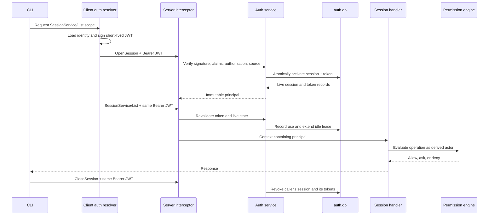

# Morph RPC Authentication: A Hands-On Crash Course

This course explains Morph's RPC authentication system from the first Ed25519 key byte to the final authorization
decision. It also builds a disposable two-identity lab where you can create tokens, watch sessions appear, trigger scope
failures, delegate limited access, revoke credentials, inspect audit events, and rotate the root identity.

The lab does not need a working model provider and does not touch your normal `~/.morph` directory.

By the end, you should be able to answer:

- What proves who an RPC caller is?
- Why are an authorization, JWT, session, and token record all required?
- How does a CLI command receive only the RPC scope it needs?
- Why can a delegated `owner` claim never become root authority?
- What is the difference between RPC authentication and Morph's permission engine?
- What happens when a token, session, authorization, or identity is revoked?
- How are streams, crashes, audit floods, retention, TLS, and identity rotation handled?

Plan on 90 minutes for the main course. The mTLS and source-reading labs are optional bonus rounds.

## 1. Meet the Cast

The system has seven related objects. Treating any two as interchangeable is the fastest way to become confused.

| Object | Useful mental model | Where it lives | What it proves or controls |
| --- | --- | --- | --- |
| Identity | Passport | Private key in `auth.json`; public key in `auth.db` | Who can sign |
| Authorization | Server-side trust envelope | `auth.db` | Maximum roles, scopes, TTL, generation, and revision |
| Access token | Signed, short-lived visa | Normally only client memory | Requested subset of the authorization |
| Auth session | Checked-in visit | `auth.db` | Idle and absolute lifetime shared by one or more tokens |
| Token record | Activated visa record | `auth.db` | Live status, exact claims, expiry, usage, and revocation |
| Principal | Validated caller card | Request context only | Immutable identity used by handlers and permissions |
| Permission decision | What the caller may do inside Morph | Permission engine state | File, command, network, browser, and other operation access |

The short version is:

> A signature proves possession of a key. An authorization says Morph trusts that key. A token narrows that trust for
> one client. A live session and token record make the credential revocable. The permission engine still decides
> whether the authenticated caller may perform the requested operation.

RPC authentication and provider authentication are unrelated:

- `morph provider login`, `morph provider status`, and `morph provider logout` manage model or web-provider
  credentials.
- `morph auth identity`, `token`, `session`, `authorization`, `audit`, and `mtls` manage Morph RPC authentication.

They share `auth.json`, but provider records and Morph's reserved `_morph` record are preserved independently.

## 2. The Non-Negotiable Invariants

Keep these rules in your head while reading code or diagnosing a failure:

1. Every unary and streaming RPC requires a JWT. `OpenSession` is a bootstrap operation, not an anonymous endpoint.
2. Tokens use Ed25519 and `typ: at+jwt`; no shared HMAC RPC secret remains.
3. The token's `kid` and `iss` identify the authorization whose public key verifies it.
4. Token claims may narrow an authorization but may never widen it.
5. A token is unusable until its session and token record are atomically activated.
6. Every ordinary call rechecks the signed token, authorization, session, token record, expiry, method scope, and
   optional certificate binding.
7. A claimed `owner` role is not root authority. Root authority is derived from the live server-side root
   authorization.
8. `CloseSession` can close only the authenticated caller's own session.
9. RPC method authorization does not bypass Morph's operation-level permission policy.
10. Raw tokens and private keys must not appear in audit records or auth-state snapshots.
11. Revocation affects new calls immediately. Active streams are watched and cancelled when their principal becomes
    inactive.
12. Plaintext RPC is permitted only on loopback. Non-loopback RPC requires TLS.

The old `rpc-owner.key`, `x-morph-owner-*` proof metadata, and unauthenticated compatibility path are gone. This is a
direct protocol cutover.

## 3. One RPC Call, Frame by Frame

Suppose `morph session list` needs `/morph.v1.SessionService/List`.



### The client side

The common client resolver follows this precedence:

1. Effective explicit token, such as `--auth.token`, `MORPH_AUTH_TOKEN`, or `auth.token`.
2. Effective explicit key, such as `--auth.key`, `MORPH_AUTH_KEY`, or `auth.key`.
3. A token stored in the profile's `_morph` record.
4. The profile identity stored in `auth.json`.
5. A newly generated profile identity.

An explicitly supplied but invalid value fails. Morph does not silently fall through to a weaker source.

Morph stores RPC private keys canonically as the 32-byte Ed25519 seed encoded as 64 hexadecimal characters. Explicit
inputs may also use Go's 64-byte Ed25519 private-key representation encoded as 128 hexadecimal characters. New
identities and rotations always write the smaller seed form. This is a breaking format: PKCS#8 PEM identity keys are
rejected rather than migrated automatically.

Morph-owned byte strings use lowercase hexadecimal text: identity IDs, generated session IDs, JWT IDs, nonces, and
CLI authorization public keys. Standard-defined encodings remain unchanged: JWT compact segments and signatures,
public JWK members, and the `x5t#S256` certificate confirmation value use unpadded Base64URL as required by their
respective standards.

When signing automatically, the client:

- uses the profile audience, normally `morph-rpc:<profile>`;
- creates a random session ID, token ID, and 16–64-byte nonce;
- uses a five-minute CLI token or eight-hour TUI token by default;
- requests the command's exact methods or services;
- adds `OpenSession` and `CloseSession`;
- keeps the JWT in memory;
- opens the session before the actual call;
- closes its own automatic session on clean shutdown.

Explicit tokens are deliberately different. Morph does not automatically broaden, renew, replace, revoke, or close
their sessions. Their lifecycle belongs to whoever supplied them.

### The server side

The server requires exactly one metadata value with this form:

```text
authorization: Bearer <JWT>
```

For `OpenSession`, it:

1. reads the unverified `kid` only to find an authorization;
2. loads that authorization's public key;
3. strictly verifies the JWT;
4. checks every claim against the authorization;
5. checks the bootstrap scope and caller source;
6. checks the optional client-certificate thumbprint;
7. creates a bounded session and token record;
8. atomically activates both records;
9. creates the principal.

For every other method, it repeats the signature and authorization checks, then also requires:

- the exact method to be allowed;
- a live session with matching identity generation and authorization revision;
- a live token record whose stored claim summary exactly matches the JWT;
- current token, idle-session, and absolute-session expiry;
- matching certificate binding when `cnf` is present.

Successful calls update last use, method counters, and the session idle deadline.

### Error categories

| Failure | Typical gRPC code | Meaning |
| --- | --- | --- |
| Missing, malformed, wrongly signed, expired, revoked, or mismatched credential | `Unauthenticated` | The caller could not establish a live identity |
| Valid credential without the requested method scope | `PermissionDenied` | Authentication succeeded, but this RPC is outside the token |
| Root-management call from a non-root principal | `PermissionDenied` | Method scope is insufficient to create root authority |
| Invalid management request | `InvalidArgument` | The request shape or supplied scope is invalid |
| Direct root revocation instead of rotation | `FailedPrecondition` | Root identity changes must use the staged rotation protocol |
| Old daemon without mandatory auth support | Client-side explanatory error | Restart with the current Morph version |

External errors intentionally avoid revealing detailed credential state. Safe detail goes to bounded audit records.

## 4. Build a Disposable Lab

Run this section from the repository root. It creates the binary, profiles, keys, databases, tokens, and certificates
under one new temporary directory.

Prerequisites:

- Go;
- a C compiler for SQLite;
- `protoc` only if generated protobuf files are missing;
- Python 3 for the token-inspection snippets;
- OpenSSL only for the optional mTLS lab.

Create the lab:

```console
export MORPH_REPO="$PWD"
export MORPH_LAB_ROOT="$(mktemp -d "${TMPDIR:-/tmp}/morph-rpc-auth-course.XXXXXX")"
export MORPH_LAB_HOME="$MORPH_LAB_ROOT/home"
export MORPH_BIN="$MORPH_LAB_ROOT/morph"
mkdir -p "$MORPH_LAB_HOME"

CGO_ENABLED=1 go build -tags sqlite_fts5 -o "$MORPH_BIN" ./cmd/morph
```

Create a reusable environment file:

```console
{
  printf 'export MORPH_LAB_ROOT=%q\n' "$MORPH_LAB_ROOT"
  printf 'export MORPH_LAB_HOME=%q\n' "$MORPH_LAB_HOME"
  printf 'export MORPH_BIN=%q\n' "$MORPH_BIN"
  cat <<'ENV'
export MORPH_RPC_PORT=50991
export MORPH_MODEL_PROVIDER=ollama
export MORPH_MODEL=rpc-auth-lab-placeholder
export MORPH_SEARCH_VECTOR_ENABLED=false
export MORPH_MEMORY_ENABLED=false

morph_lab() {
  HOME="$MORPH_LAB_HOME" "$MORPH_BIN" --profile rpc-auth-lab "$@"
}

morph_delegate() {
  HOME="$MORPH_LAB_HOME" \
    MORPH_AUTH_AUDIENCE=morph-rpc:rpc-auth-lab \
    "$MORPH_BIN" --profile rpc-auth-delegate "$@"
}

with_token() {
  token_file="$1"
  shift
  (
    export MORPH_AUTH_TOKEN
    MORPH_AUTH_TOKEN="$(tr -d '\r\n' < "$token_file")"
    morph_lab "$@"
  )
}
ENV
} > "$MORPH_LAB_ROOT/lab.env"

source "$MORPH_LAB_ROOT/lab.env"
printf 'Lab environment: %s\n' "$MORPH_LAB_ROOT/lab.env"
```

`ollama` is only a placeholder provider here. The auth exercises never make a model request, so Ollama does not need
to be running. Vector search and memory are disabled to avoid requiring an embedding model.

If port `50991` is already in use, change it in `lab.env`, then source the file again.

Initialize the root profile and its identity:

```console
morph_lab profile init rpc-auth-lab
morph_lab auth identity init
morph_lab auth identity show
morph_lab profile doctor rpc-auth-lab
```

Expected identity output has a stable lowercase hexadecimal ID and generation 1:

```text
identity: <40-character truncated public-key SHA-256 digest>
generation: 1
```

Do not print `auth.json`. It contains the private key.

Open a second terminal, copy the printed `lab.env` path, and source it:

```console
source /tmp/morph-rpc-auth-course.ABC123/lab.env
```

Use the exact path printed by terminal A; `ABC123` is only an example.

In terminal A, start the daemon:

```console
source "$MORPH_LAB_ROOT/lab.env"
morph_lab daemon
```

Leave it running. In terminal B:

```console
morph_lab daemon status
```

You should see `running`, `SERVING`, profile `rpc-auth-lab`, and `127.0.0.1:50991`.

## 5. Inspect the Root Trust

List the daemon's authorizations:

```console
morph_lab auth --json authorization list
```

The first authorization should contain:

```text
identity_id:        the hex identity digest shown by identity show
owner_id:           rpc-auth-lab
user_id:            the root identity ID
roles:              ["owner"]
services:           ["*"]
maximum_ttl_seconds: 86400
generation:         1
revision:           1
status:             active
```

The `*` scope is not a token bypass. It is the server-side root authorization envelope. Only the live root
authorization can cause `Principal.RootAuthorization` to be true.

Inspect the profile directory without displaying secrets:

```console
PROFILE_HOME="$MORPH_LAB_HOME/.morph/profiles/rpc-auth-lab"
ls -la "$PROFILE_HOME"
```

Important files:

| File | Contents | Security behavior |
| --- | --- | --- |
| `config.yaml` | Audience, TTLs, TLS, RPC address, and other profile config | Secrets are redacted by config diagnostics |
| `auth.json` | Provider credentials and `_morph` private identity | Directory `0700`, file `0600`, locked and atomically replaced |
| `auth.db` | Public authorizations, sessions, token metadata, audit snapshot | File `0600`; symlinks rejected |
| `runtime.json` | Active daemon PID and RPC endpoint | Lets profile-aware clients find the daemon |

Optional SQLite inspection:

```console
sqlite3 "$PROFILE_HOME/auth.db" '.schema morph_auth_state'
sqlite3 "$PROFILE_HOME/auth.db" \
  'select id, length(payload), updated_at from morph_auth_state;'
```

The SQLite store persists one atomic JSON snapshot. It contains token metadata and nonces, not raw JWT strings or
private keys.

## 6. Watch Automatic CLI Credentials Live and Die

Run the same command twice:

```console
morph_lab auth session list
morph_lab auth session list
```

During each request, the command's current session appears as `active`. When the command finishes, the client invokes
self-bound `CloseSession`, which revokes that session and all of its tokens. The second listing therefore sees the
first command's revoked session plus its own currently active session.

Now inspect tokens:

```console
morph_lab auth --json token list
```

Find the token whose status is active while the response is being produced. Its methods should resemble:

```text
/morph.v1.AuthService/ListTokens
/morph.v1.AuthService/OpenSession
/morph.v1.AuthService/CloseSession
```

This is least privilege in motion. The command did not receive every RPC service. It received its requested management
method and the two automatic-session lifecycle methods.

Look at the audit trail:

```console
morph_lab auth --json audit list --limit 30
```

You should see a repeating lifecycle:

```text
session_opened
token_activated
session_revoked   reason="authenticated client closed"
```

The management command that reads the audit also creates and closes its own short-lived session.

### CLI and TUI lifecycle differences

| Client | Default token TTL | Renewal | Clean shutdown |
| --- | --- | --- | --- |
| CLI command | 5 minutes | No | Closes its automatic session |
| TUI | 8 hours | Renews in the same session near the last 10% of TTL | Closes its automatic session |
| Explicit-token client | Token's own TTL | Never automatically | Leaves its session and token alone |

Automatic clients also replace an idle session before 90% of its configured idle TTL. Activation, renewal, refresh,
and closure are serialized so a close cannot race with a replacement session and leak it.

## 7. Mint and Inspect an Explicit Method-Scoped Token

Generate a token that can list auth sessions and nothing else:

```console
SCOPED_TOKEN="$MORPH_LAB_ROOT/list-sessions.jwt"

morph_lab auth token generate \
  --session course-list-sessions \
  --method /morph.v1.AuthService/ListSessions \
  --ttl 10m \
  --output "$SCOPED_TOKEN"

ls -l "$SCOPED_TOKEN"
```

The file is created with mode `0600` and must not already exist. Morph adds `OpenSession` because the token must
bootstrap its durable session. It does not add `CloseSession` because explicit tokens are not automatically closed.

Decode the header and payload locally:

```console
python3 - "$SCOPED_TOKEN" <<'PY'
import base64
import json
import pathlib
import sys

token = pathlib.Path(sys.argv[1]).read_text().strip()
header, payload, _signature = token.split(".")

def decode(part):
    padded = part + "=" * (-len(part) % 4)
    return json.loads(base64.urlsafe_b64decode(padded))

print("HEADER")
print(json.dumps(decode(header), indent=2))
print("\nPAYLOAD")
print(json.dumps(decode(payload), indent=2))
PY
```

Decoding is not verification. Anyone holding a JWT can decode it.

Important fields:

| Claim | Meaning |
| --- | --- |
| `kid` header | Final 20 bytes of the raw public key's SHA-256 digest, encoded as hex and used to find the authorization |
| `typ` header | Must be `at+jwt` |
| `alg` header | Must be `EdDSA` |
| `iss` | Signing identity ID; must agree with `kid` |
| `sub` | Authorized user ID |
| `aud` | Exact Morph RPC audience |
| `iat`, `nbf`, `exp` | Issued, not-before, and expiry times |
| `jti` | Unique generated token record ID in lowercase hex |
| `sid` | Durable generated auth session ID in lowercase hex |
| `owner_id` | Authorization owner boundary |
| `roles` | Requested subset of authorized roles |
| `services`, `methods` | Requested RPC scopes |
| `identity_generation` | Invalidates credentials after identity rotation |
| `authorization_revision` | Invalidates credentials after authorization changes |
| `nonce` | Bounded lowercase-hex uniqueness value; not proof against theft |
| `cnf` | Optional mTLS client-certificate thumbprint |

The nonce and `jti` do not make an active JWT non-replayable. This remains a bearer token unless it has a verified
certificate binding.

Use the explicit token:

```console
with_token "$SCOPED_TOKEN" auth session list
```

It succeeds and leaves `course-list-sessions` active because Morph will not manage an explicit token's lifecycle.

Now try an RPC outside its method scope:

```console
with_token "$SCOPED_TOKEN" auth token list
```

Expected result:

```text
rpc error: code = PermissionDenied desc = RPC method is not authorized
```

The signature and live state were valid. The requested method was not.

Confirm the safe audit record:

```console
morph_lab auth --json audit list --limit 20
```

Look for `scope_denied`. The audit contains safe IDs and the method, not the JWT.

## 8. Revoke a Token and a Session

Extract the explicit token's `jti` without printing the token:

```console
TOKEN_ID="$(
  python3 - "$SCOPED_TOKEN" <<'PY'
import base64
import json
import pathlib
import sys

payload = pathlib.Path(sys.argv[1]).read_text().strip().split(".")[1]
payload += "=" * (-len(payload) % 4)
print(json.loads(base64.urlsafe_b64decode(payload))["jti"])
PY
)"

printf 'Token ID: %s\n' "$TOKEN_ID"
```

Revoke it with a root automatic credential:

```console
morph_lab auth token revoke "$TOKEN_ID" --reason "completed token revocation lab"
```

Retry it:

```console
with_token "$SCOPED_TOKEN" auth session list
```

Expected result is `Unauthenticated`. The JWT still has a valid Ed25519 signature and may not be expired, but its live
token record is revoked.

Now create a second token with a known session:

```console
SESSION_TOKEN="$MORPH_LAB_ROOT/session-revocation.jwt"

morph_lab auth token generate \
  --session course-session-revocation \
  --method /morph.v1.AuthService/ListSessions \
  --ttl 10m \
  --output "$SESSION_TOKEN"

with_token "$SESSION_TOKEN" auth session list
```

Revoke the session:

```console
morph_lab auth session revoke course-session-revocation \
  --reason "completed session revocation lab"
```

Retry the token:

```console
with_token "$SESSION_TOKEN" auth session list
```

It is now unauthenticated. Session revocation cascades to every token in that session.

This distinction matters:

- token revocation kills one token;
- session revocation kills the visit and all of its tokens;
- authorization revision or revocation kills all sessions tied to that authorization state;
- identity rotation kills the old root authorization and its sessions and tokens.

## 9. Delegate an Operator Without Creating Another Root

This lab creates a second Ed25519 identity, grants it two exact application methods, and proves that method scope still
does not grant root-management authority.

Initialize the delegate profile:

```console
morph_delegate profile init rpc-auth-delegate
morph_delegate auth identity init
morph_delegate auth identity show
```

The grant command needs the raw public key encoded as 64 lowercase hexadecimal characters. Create a small helper that
reads the delegate's private record but prints only its safe identity ID and public key:

```console
cat > "$MORPH_LAB_ROOT/export-public.go" <<'GO'
package main

import (
	"crypto/ed25519"
	"encoding/hex"
	"encoding/json"
	"fmt"
	"os"
)

func main() {
	body, err := os.ReadFile(os.Args[1])
	if err != nil {
		panic(err)
	}

	var document map[string]json.RawMessage
	if err := json.Unmarshal(body, &document); err != nil {
		panic(err)
	}

	var record struct {
		IdentityID string `json:"identityId"`
		PrivateKey string `json:"privateKey"`
	}
	if err := json.Unmarshal(document["_morph"], &record); err != nil {
		panic(err)
	}

	key, err := hex.DecodeString(record.PrivateKey)
	if err != nil {
		panic(err)
	}

	privateKey := ed25519.NewKeyFromSeed(key)
	publicKey := privateKey.Public().(ed25519.PublicKey)
	fmt.Printf("%s %s\n",
		record.IdentityID,
		hex.EncodeToString(publicKey),
	)
}
GO

DELEGATE_AUTH_JSON="$MORPH_LAB_HOME/.morph/profiles/rpc-auth-delegate/auth.json"
read -r DELEGATE_ID DELEGATE_PUBLIC_KEY < <(
  go run "$MORPH_LAB_ROOT/export-public.go" "$DELEGATE_AUTH_JSON"
)

printf 'Delegate identity: %s\n' "$DELEGATE_ID"
```

First try to delegate `owner`:

```console
morph_lab auth authorization grant \
  --identity "$DELEGATE_ID" \
  --public-key "$DELEGATE_PUBLIC_KEY" \
  --owner delegate-owner \
  --user "$DELEGATE_ID" \
  --role owner \
  --method /morph.v1.SessionService/List \
  --method /morph.v1.AuthService/OpenSession \
  --maximum-ttl 30m
```

Expected result is `PermissionDenied`. The management API rejects delegated `owner` and `*`. Root authority cannot be
manufactured by copying an owner-shaped claim.

Grant a bounded operator authorization:

```console
morph_lab auth authorization grant \
  --identity "$DELEGATE_ID" \
  --public-key "$DELEGATE_PUBLIC_KEY" \
  --owner delegate-owner \
  --user "$DELEGATE_ID" \
  --role operator \
  --method /morph.v1.SessionService/List \
  --method /morph.v1.AuthService/ListTokens \
  --method /morph.v1.AuthService/OpenSession \
  --maximum-ttl 30m
```

Why grant `ListTokens` if operators may not list tokens? It lets us separate the two authorization layers:

1. the token may pass the interceptor's method-scope check;
2. the handler still rejects it because the principal is not the root owner.

Generate a token from the delegate identity. Its audience must name the root daemon:

```console
DELEGATE_TOKEN="$MORPH_LAB_ROOT/delegate.jwt"

morph_delegate auth token generate \
  --owner delegate-owner \
  --user "$DELEGATE_ID" \
  --role operator \
  --method /morph.v1.SessionService/List \
  --method /morph.v1.AuthService/ListTokens \
  --ttl 10m \
  --output "$DELEGATE_TOKEN"
```

Use it against the root daemon:

```console
with_token "$DELEGATE_TOKEN" session list
```

That succeeds because:

- the delegate signed the token;
- the root daemon trusts the delegate's public key;
- the token claims are a subset of the authorization;
- the exact session-list method is allowed;
- that application handler does not require root ownership.

Now call the owner-management method that was intentionally included:

```console
with_token "$DELEGATE_TOKEN" auth token list
```

It fails with `PermissionDenied` and `owner authorization is required`.

The token had the method, but its principal was not a root owner. `IsRootOwner` requires both:

```text
live server-side root authorization
AND
owner role in the narrowed token
```

Revoke the delegated authorization:

```console
morph_lab auth authorization revoke "$DELEGATE_ID" \
  --reason "completed delegation lab"
```

Retry:

```console
with_token "$DELEGATE_TOKEN" session list
```

The token now fails authentication immediately. Updating or revoking an authorization advances its revision and
revokes sessions tied to the previous revision.

### Services versus methods

Canonical scopes use these forms:

```text
method:  /package.Service/Method
service: /package.Service
root:    *
```

Examples:

```text
/morph.v1.SessionService/List
/morph.v1.SessionService
*
```

Matching is structural and exact. Caller-invented aliases and partial string matches do not work. Authorization grants
also reject services and methods outside Morph's registered RPC catalog.

## 10. Authentication Is Not the Permission Engine

After authentication, the server places one immutable `Principal` in the request context. `rpcmeta` derives a
permission actor:

- a root-owner principal from a matching `cli` or `tui` source becomes `local_owner`;
- every other authenticated identity becomes `rpc_client`;
- permission surface metadata alone can never create owner authority.

The client also sends a permission surface and preset. These are contextual inputs to the permission engine, not JWT
claims and not proof of identity.

This gives two independent gates:

```text
Gate 1: May this credential call this RPC method?
Gate 2: May this authenticated actor perform the operation requested inside it?
```

For example, a token might authorize a chat or browser method while the permission policy still denies a filesystem,
command, browser, or network operation triggered by that call.

`full_access` is a permission preset. It is not an RPC-authentication bypass.

## 11. Rotate the Root Identity: The Final Boss

Create and activate one last token signed by generation 1:

```console
PRE_ROTATION_TOKEN="$MORPH_LAB_ROOT/pre-rotation.jwt"

morph_lab auth token generate \
  --session course-pre-rotation \
  --method /morph.v1.AuthService/ListSessions \
  --ttl 20m \
  --output "$PRE_ROTATION_TOKEN"

with_token "$PRE_ROTATION_TOKEN" auth session list
```

Record the current identity:

```console
morph_lab auth identity show
```

Rotate:

```console
morph_lab auth identity rotate
morph_lab auth identity show
```

The ID changes and generation becomes 2.

Retry the old token:

```console
with_token "$PRE_ROTATION_TOKEN" auth session list
```

It fails. Rotation:

- prepares a new private key in `auth.json` as `pendingIdentity`;
- asks the authenticated current root to rotate the server-side root;
- verifies the next public key's thumbprint and exact next generation;
- revokes the previous root authorization;
- revokes the old root's sessions and tokens;
- installs the new root authorization;
- applies new domain-separated runtime keys;
- atomically promotes the pending private key;
- recovers a partially completed rotation on daemon startup.

Inspect the result:

```console
morph_lab auth --json authorization list
morph_lab auth --json audit list --limit 30
```

You should see the old root authorization revoked, the new one active, and an `identity_rotated` audit event.

Rotation does not silently revoke unrelated delegated authorizations. Revoke those separately when the security event
requires it.

If `auth.key` points to externally managed key material, `morph auth identity rotate` refuses to replace it. Rotate
that key at its source and follow the configured-identity generation protocol.

## 12. Sessions, Streams, and Durability

### Session deadlines

Every session has:

- an idle expiry, extended by successful use or stream keepalive;
- an absolute expiry, which idle extension may never exceed.

Defaults:

```yaml
auth:
  cliTokenTTL: 5m
  tuiTokenTTL: 8h
  maximumTokenTTL: 24h
  sessionIdleTTL: 15m
  sessionMaximumTTL: 24h
  maximumTokenBytes: 16384
  nonceBytes: 24
```

Configuration validation requires positive lifetimes, default token TTLs no larger than `maximumTokenTTL`, idle TTL no
larger than the session maximum, token size between 1 KiB and 1 MiB, and nonce length between 16 and 64 bytes.

### Active streams

The stream interceptor starts a principal watcher. It checks the session and token periodically:

```text
interval = sessionIdleTTL / 3
maximum  = 1 minute
minimum  = 100 milliseconds
```

Each successful check extends the session's idle lease. Revocation, expiry, generation change, or authorization
revision change cancels the authenticated stream context.

### SQLite write behavior

The SQLite store keeps an in-memory working snapshot protected by a mutex and persists mutations to one database row.

- activation, revocation, authorization changes, rotation, and audit appends persist immediately;
- ordinary use updates are coalesced to at most one snapshot write per second;
- stream keepalives persist no slower than one third of the current lease, capped at one second;
- a failed persistence restores the previous in-memory snapshot;
- dirty use state is flushed on clean close.

The lease-relative keepalive rule matters for very short idle TTLs: persistence happens before a crash can expose an
already-expired durable lease.

Run the durability-focused tests:

```console
CGO_ENABLED=1 go test -tags sqlite_fts5 ./internal/auth/storesqlite \
  -run 'TestStore_(PersistsStreamKeepAliveBeforeClose|PersistsKeepAliveBeforeShortDurableLeaseExpires|DefersKeepAliveWithinDurableLeaseMargin|RestoresKeepAliveAfterPersistenceFailure)' \
  -v
```

Run the stream-liveness service test:

```console
CGO_ENABLED=1 go test -tags sqlite_fts5 ./internal/auth \
  -run TestService_KeepAliveExtendsActiveStreamSession \
  -v
```

## 13. Audit Flood Control and Retention

Authentication failure auditing is intentionally lossy under attack.

Within each one-second window:

- identical failures are coalesced using event, safe IDs, reason, and token fingerprint;
- unverified token text is hashed only for coalescing and is never written to the audit event;
- at most 127 detailed failures are stored;
- the next distinct failure produces one `authentication_audit_rate_limited` marker;
- additional failures in that window are suppressed;
- stale coalescing keys are evicted.

This bounds both validly signed scope attacks and arbitrary malformed-token floods.
The in-memory audit history also retains at most 10,000 events, dropping the oldest as new events arrive.

Manual inspection:

```console
morph_lab auth --json audit list --limit 50
```

Manual pruning:

```console
morph_lab auth audit prune --older-than 1m --limit 1000
```

Despite the command name, pruning covers eligible token records, session records, and audit history. Live records are
not deleted merely because the audit cutoff is old.

Daemon retention runs:

- once at startup;
- every hour;
- with a 30-day cutoff;
- under a 30-second timeout;
- in at most 10 batches of 1,000 records.

Each in-memory prune batch initially divides its budget fairly among tokens, sessions, and audit events, then
redistributes unused budget. SQLite performs multiple in-memory batches and persists one final snapshot.

Exercise the controls directly:

```console
CGO_ENABLED=1 go test -tags sqlite_fts5 ./internal/auth/... ./internal/cli/daemon \
  -run 'Test(Service_RateLimits|Store_Prune|PruneRPCAuthState)' \
  -v
```

## 14. Optional mTLS Bonus Round

JWT remains mandatory in every TLS mode:

| Mode | Transport | Client certificate | JWT |
| --- | --- | --- | --- |
| `disabled` | Plaintext loopback only | No | Required |
| `server` | Server-authenticated TLS | No | Required |
| `mutual` | Server and client authenticated | Required | Required |

In mutual mode, automatically minted tokens include:

```json
{
  "cnf": {
    "x5t#S256": "<client-certificate-thumbprint>"
  }
}
```

The server compares that claim with the certificate on the current connection. A copied bound JWT cannot be used
without the matching client certificate and key.

Stop the lab daemon with `Ctrl-C`, then generate a small lab CA:

```console
TLS_DIR="$MORPH_LAB_ROOT/tls"
mkdir -p "$TLS_DIR"

openssl req -x509 -newkey rsa:2048 -nodes \
  -keyout "$TLS_DIR/ca.key" \
  -out "$TLS_DIR/ca.crt" \
  -days 1 \
  -subj '/CN=Morph RPC Lab CA'

openssl req -newkey rsa:2048 -nodes \
  -keyout "$TLS_DIR/server.key" \
  -out "$TLS_DIR/server.csr" \
  -subj '/CN=127.0.0.1'

cat > "$TLS_DIR/server.ext" <<'EOF'
subjectAltName=IP:127.0.0.1
extendedKeyUsage=serverAuth
EOF

openssl x509 -req \
  -in "$TLS_DIR/server.csr" \
  -CA "$TLS_DIR/ca.crt" \
  -CAkey "$TLS_DIR/ca.key" \
  -CAcreateserial \
  -out "$TLS_DIR/server.crt" \
  -days 1 \
  -extfile "$TLS_DIR/server.ext"

openssl req -newkey rsa:2048 -nodes \
  -keyout "$TLS_DIR/client.key" \
  -out "$TLS_DIR/client.csr" \
  -subj '/CN=Morph RPC Lab Client'

cat > "$TLS_DIR/client.ext" <<'EOF'
extendedKeyUsage=clientAuth
EOF

openssl x509 -req \
  -in "$TLS_DIR/client.csr" \
  -CA "$TLS_DIR/ca.crt" \
  -CAkey "$TLS_DIR/ca.key" \
  -CAcreateserial \
  -out "$TLS_DIR/client.crt" \
  -days 1 \
  -extfile "$TLS_DIR/client.ext"
```

Append the TLS settings to `lab.env`:

```console
cat >> "$MORPH_LAB_ROOT/lab.env" <<'ENV'
export MORPH_RPC_TLS_MODE=mutual
export MORPH_RPC_TLS_CERT="$MORPH_LAB_ROOT/tls/server.crt"
export MORPH_RPC_TLS_KEY="$MORPH_LAB_ROOT/tls/server.key"
export MORPH_RPC_TLS_CLIENT_CA="$MORPH_LAB_ROOT/tls/ca.crt"
export MORPH_RPC_TLS_SERVER_CA="$MORPH_LAB_ROOT/tls/ca.crt"
export MORPH_RPC_TLS_CLIENT_CERT="$MORPH_LAB_ROOT/tls/client.crt"
export MORPH_RPC_TLS_CLIENT_KEY="$MORPH_LAB_ROOT/tls/client.key"
export MORPH_RPC_TLS_SERVER_NAME=127.0.0.1
ENV

source "$MORPH_LAB_ROOT/lab.env"
```

Source the file again in terminal A and restart:

```console
morph_lab daemon
```

From terminal B:

```console
source "$MORPH_LAB_ROOT/lab.env"
morph_lab auth mtls status
morph_lab daemon status
morph_lab auth --json token list
```

The active automatic token displayed during `token list` should have a non-empty `certificate_thumbprint`.

Try a client without its certificate:

```console
(
  export MORPH_RPC_TLS_CLIENT_CERT=
  export MORPH_RPC_TLS_CLIENT_KEY=
  morph_lab daemon status
)
```

The mutual-TLS client setup or handshake fails before RPC authentication. With the certificate restored, a missing or
invalid JWT still fails at the mandatory auth interceptor. The layers are additive.

## 15. Source-Code Safari

Read the implementation in this order:

| Stop | File | What to look for |
| --- | --- | --- |
| 1 | [`internal/auth/identity.go`](../internal/auth/identity.go) | Ed25519 generation, canonical seed-hex encoding, 20-byte public-key identity IDs, domain-separated secrets |
| 2 | [`internal/auth/token.go`](../internal/auth/token.go) | Required claims, strict EdDSA parsing, nonce and scope validation |
| 3 | [`internal/auth/scope.go`](../internal/auth/scope.go) | Canonical method/service forms and exact matching |
| 4 | [`internal/auth/store.go`](../internal/auth/store.go) | Authorization, session, token, audit, and principal data contracts |
| 5 | [`internal/auth/service.go`](../internal/auth/service.go) | Bootstrap, per-call validation, root derivation, keepalive, audit bounding |
| 6 | [`internal/rpc/client/auth_resolver.go`](../internal/rpc/client/auth_resolver.go) | Secret precedence, automatic tokens, renewal, activation, self-close |
| 7 | [`internal/rpc/client/auth_interceptor.go`](../internal/rpc/client/auth_interceptor.go) | Bearer metadata on unary and stream calls |
| 8 | [`internal/rpc/server/auth.go`](../internal/rpc/server/auth.go) | Mandatory server interceptors, status mapping, stream cancellation |
| 9 | [`internal/rpc/auth_service.go`](../internal/rpc/auth_service.go) | Root-only management and self-bound `CloseSession` |
| 10 | [`internal/rpc/rpcmeta/permissions.go`](../internal/rpc/rpcmeta/permissions.go) | Principal-to-permission-actor mapping |
| 11 | [`internal/auth/storememory/store.go`](../internal/auth/storememory/store.go) | Atomic activation, revocation cascade, usage, audit, fair pruning |
| 12 | [`internal/auth/storesqlite/store.go`](../internal/auth/storesqlite/store.go) | Snapshot persistence, rollback, coalescing, durable leases |
| 13 | [`internal/cli/daemon/rpc.go`](../internal/cli/daemon/rpc.go) | Identity loading, root seeding, TLS, store lifecycle, scheduled pruning |
| 14 | [`cmd/auth/morph.go`](../cmd/auth/morph.go) | Human-facing identity, token, session, authorization, audit, and mTLS CLI |
| 15 | [`internal/rpc/proto/morph.proto`](../internal/rpc/proto/morph.proto) | Wire contract and auth-management RPCs |

Good tests to read as executable specifications:

```console
CGO_ENABLED=1 go test -tags sqlite_fts5 ./internal/auth ./internal/auth/storememory \
  ./internal/auth/storesqlite ./internal/rpc/server ./internal/rpc/client ./internal/rpc \
  -run 'Test(AccessToken|Identity|Scope|Service|Store|AuthResolver|AuthUnary|AuthStream|AuthService)' \
  -v
```

The especially valuable cases are:

- scope widening and wrong method;
- delegated owner rejection;
- root authority not derived from token claims;
- token and session revocation;
- client activation/close races;
- certificate binding;
- keepalive durability across reopen;
- fair and bounded pruning;
- failure-audit coalescing and global rate limiting.

## 16. Troubleshooting by Layer

### `morph identity is not initialized`

Run:

```console
morph_lab auth identity init
```

The daemon also creates the profile identity when no configured or stored identity exists.

### `RPC authentication failed`

Check, in order:

1. correct profile and endpoint;
2. correct audience;
3. token expiry and not-before time;
4. identity generation;
5. authorization revision and status;
6. session and token live status;
7. certificate binding in mutual TLS.

Useful commands:

```console
morph_lab daemon status
morph_lab auth identity show
morph_lab auth --json authorization list
morph_lab auth session list
morph_lab auth token list
morph_lab auth --json audit list --limit 50
```

### `RPC method is not authorized`

The credential is probably valid but lacks the exact canonical method or service. Decode the token locally and compare
`methods` and `services` with the requested `/package.Service/Method`.

### `owner authorization is required`

The method scope passed, but the handler requires `Principal.IsRootOwner()`. A delegated role, permission surface, or
`full_access` preset cannot satisfy that requirement.

### Automatic token cannot open a delegated session

An automatically managed session needs both:

```text
/morph.v1.AuthService/OpenSession
/morph.v1.AuthService/CloseSession
```

in its allowed envelope. Explicit-token sessions are not automatically closed and therefore need only `OpenSession`
plus their application scopes.

### `RPC TLS is required for non-loopback addresses`

Either bind to `127.0.0.1`/`localhost` or configure server TLS or mutual TLS. Morph does not permit plaintext
non-loopback RPC.

### Raw `go test` reports `no such module: fts5`

Use the repository's required build settings:

```console
CGO_ENABLED=1 go test -tags sqlite_fts5 ./path/to/package
```

For the complete project:

```console
make test
```

## 17. Clean Up

Stop the lab daemon with `Ctrl-C` in terminal A.

Confirm the path before deleting anything:

```console
printf 'Disposable lab: %s\n' "$MORPH_LAB_ROOT"
```

Then remove that exact temporary directory using your normal safe cleanup workflow. It contains:

- the temporary Morph binary;
- both disposable profiles;
- all lab identities and tokens;
- `auth.db`;
- optional TLS private keys.

Do not keep the JWT or TLS keys after the lab.

## 18. The Five-Minute Recall Test

If you can answer these without looking back, the system has clicked:

1. Why is a correctly signed JWT still unusable before `OpenSession`?
2. Which object is the upper bound: JWT or server-side authorization?
3. Why does a delegated `owner` claim not become root authority?
4. What does revoking a session do to its tokens?
5. Why is an explicit token not closed when the CLI exits?
6. What two gates separate an RPC method from a filesystem or command operation?
7. How does a stream notice revocation?
8. What survives a daemon crash, and where?
9. Why does mTLS not replace JWT?
10. Which two values invalidate old credentials after authorization change or identity rotation?

Answers:

1. Morph requires durable activation of both the session and token record.
2. The server-side authorization; JWT claims must be a subset.
3. Root status is derived from the live root authorization and combined with the token's owner role.
4. The session and every token belonging to it become revoked.
5. Explicit credentials are caller-managed and must never be silently replaced or revoked.
6. RPC method authorization, then operation-level permission evaluation.
7. A keepalive watcher rechecks its principal and cancels the stream context on failure.
8. Identity in `auth.json`; authorizations, sessions, token metadata, and audit state in `auth.db`.
9. TLS protects and optionally binds the transport; JWT still supplies Morph identity, scope, session, and revocation.
10. `authorization_revision` and `identity_generation`.

That is the whole machine: possession, trust, narrowing, activation, continuous validation, policy, durability, and
revocation—each with one job and no magical bypass.
