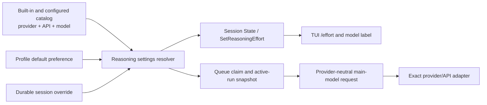
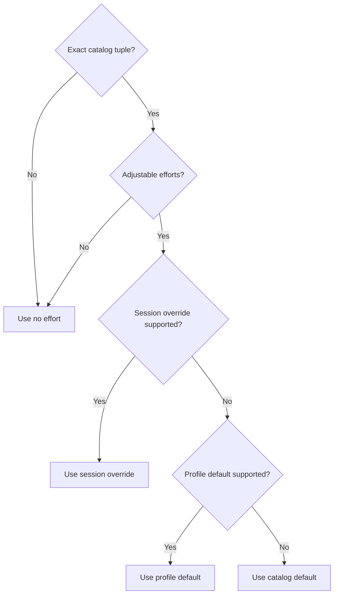

# feat: Add catalog-driven reasoning effort controls

## Summary

Let users inspect and set the reasoning effort for the current session with `/effort`, apply that setting consistently to future main-model turns, and display the selected effort beside the model name. Make provider, API, and model catalog metadata authoritative so Morph sends an effort control only when the exact catalog tuple declares it supported; provider drift remains an ordinary request failure rather than triggering an inferred fallback.

## Problem Frame

Morph currently knows only whether a catalog model is marked as reasoning-capable. The in-progress thinking-summary work uses that boolean to request an OpenAI reasoning summary, but the agent request contract has no reasoning-effort field and the TUI has no way to select one. As a result, a prompt can request more reasoning in natural language without changing the provider's actual reasoning configuration.

A single global list is not correct. OpenAI, Anthropic, OpenRouter, Copilot, and Ollama expose different controls, model-specific effort sets, defaults, and summary behavior. Effort must therefore be resolved from the exact provider, API transport, and model, while profile configuration supplies a default preference and durable session state supplies an override.

---

## Requirements

### Catalog and configuration

- R1. Every catalog model can describe reasoning support independently from adjustable effort support, using an ordered list of supported effort tokens, a catalog default, and reasoning-summary support identified everywhere by one canonical provider/API/model key.
- R2. Catalog validation rejects contradictory or ambiguous metadata: non-reasoning entries cannot advertise efforts or summaries; effort values must be nonblank and unique; the case-insensitive command aliases `default` and `reset` cannot be efforts; and an adjustable model's default must be one of its supported efforts.
- R3. Catalog order is preserved end to end and is the order shown by `/effort`; Morph does not impose a global low-to-high enum or map an unsupported value to the nearest value.
- R4. Explicit provider-model configuration can supply or override the same reasoning metadata for a custom model. Unknown or discovered models without exact metadata remain non-adjustable and receive no effort parameter.
- R5. `models.main.reasoningEffort` is an optional profile default preference. An omitted or empty value means inherit the catalog default; the literal `none` remains a valid explicit effort when the selected model supports it.

### Durable session behavior

- R6. Each session can persist an optional reasoning-effort override independently in SQLite and memory storage. Existing sessions require no backfill and inherit profile/catalog defaults.
- R7. One resolver computes structured state from the current provider/API/model tuple using this precedence: supported session override, supported profile default, catalog default, then no effort for a non-adjustable model.
- R8. An override or profile value that is unsupported by the current tuple remains stored but dormant. The resolver uses the next valid source, reports a stable fallback reason, and restores the dormant value automatically if a later model tuple supports the exact token.
- R9. Setting an effort validates against the server's current tuple and persists only a canonical supported token. Invalid input or a stale model selection fails without changing the stored override; resetting clears the override even when it is dormant.
- R10. Session reasoning state exposes the model tuple, reasoning and adjustability flags, ordered efforts, raw session override, profile and catalog defaults, effective effort, resolution source, fallback code, and any active-run effort snapshot.
- R11. Concurrent effort setters use server-authoritative last-write-wins semantics. Each response returns the resulting canonical state, while a request prepared for a stale provider/API/model tuple is rejected and must refresh.

### Turn execution and provider requests

- R12. Claiming a follow-up and creating its active run atomically resolves and persists the provider/API/model and effort snapshot from the session override visible in that same transaction or memory lock. Every main-model request in that turn, including tool-loop iterations and iteration-exhaustion fallback, uses the same snapshot.
- R13. Changing effort during an active run affects the next not-yet-active turn. Steering remains part of the active turn and keeps its existing snapshot; queued follow-ups snapshot the setting when each is claimed, not when it was enqueued.
- R14. Session effort applies only to the main agent model. It does not leak into summary, compaction, title, memory-flush, embedding, or reranking requests that may use other model configurations.
- R15. The provider-neutral model request carries the resolved effort and independently resolved summary request. Provider adapters serialize only controls supported by the exact catalog tuple and omit unsupported or unknown controls.
- R16. Supported adapters use their native wire shape: OpenAI Responses uses `reasoning.effort`, OpenAI Chat Completions uses `reasoning_effort`, Anthropic Messages merges `output_config.effort` with any structured-output format, OpenRouter uses only the documented control for its configured transport, and Ollama native uses a string `think` only for explicitly cataloged level-based models.
- R17. Copilot and other undocumented transports do not inherit effort capability from an underlying model name or a shared OpenAI client. A provider rejection fails through the existing turn/retry path with the same snapshot and never causes silent downgrade, remapping, or override deletion.
- R18. Reasoning-summary support stays separate from effort support. Existing reasoning and `reasoning_summary` stream channels and thinking-cell behavior are preserved; `reasoning.summary` or another provider summary selector is sent only where the exact tuple declares it safe.

### TUI and command experience

- R19. `/effort` with no argument opens a selector/status view for the current session using the catalog's effort order and marking the raw override, effective value, default source, and any fallback. During a run, it presents the active-run snapshot separately from the selected next-turn effort.
- R20. `/effort <value>` sets the current session override, while `/effort default` and `/effort reset` clear it. Input is trimmed and matched case-insensitively to a catalog token, then stored and displayed in canonical form.
- R21. A reasoning model without adjustable efforts reports that effort control is unavailable; a non-reasoning model reports it as not applicable. Neither case mutates the session or emits a provider effort field.
- R22. The header and composer status bar render one shared model label in the form `Model Display Name (effective effort)` when an effective effort exists. Models without an effective effort retain the existing unsuffixed display name.
- R23. A successful `/effort` change updates the model label immediately, including during an active run. If the active-run snapshot differs, command and selector feedback state that the current turn keeps its prior effort while the newly displayed effort applies to the next turn.
- R24. Session hydration, session switching, reconnect after `/models`, and effort mutation all refresh from authoritative session reasoning state. A model switch does not claim a final fallback in the TUI until the daemon reconnects and returns the new tuple's resolution.

### Compatibility and verification

- R25. Older profile files and databases continue to load. Unknown persisted effort strings survive round trips, remain dormant, and can be cleared; newly entered unknown strings are rejected.
- R26. The feature is covered across catalog validation, config normalization, both stores, session conversion, resolver precedence, queue/turn races, RPC permission/error mapping, provider request serialization, TUI commands and narrow rendering, daemon reconnect, and existing reasoning-summary rendering.

---

## Key Technical Decisions

- KTD-1. **Use one canonical provider/API/model key across the effective catalog.** `ModelDefinition` already carries the API transport, but registry indexing, configured overlays, option merging, selection, and stale checks do not consistently treat it as identity. A shared key prevents same-ID transports and custom metadata from inheriting or shadowing the wrong capability.
- KTD-2. **Keep reasoning, adjustable effort, and summary support separate.** `Reasoning=true` means the model can reason; an empty effort list is valid for fixed, adaptive, boolean-only, or undocumented control. Summary output has its own capability because some reasoning models expose no readable summary.
- KTD-3. **Use catalog-ordered, string-backed effort values.** Provider vocabularies evolve and the installed SDK may lag new values such as `max`. A string-backed domain type allows explicit future catalog values while validation prevents arbitrary user input from reaching providers.
- KTD-4. **Treat profile and session values as preferences, not destructive model bindings.** An unsupported value becomes dormant instead of being cleared during a global model switch. Switching back restores it, and setting a different value replaces the single stored session preference.
- KTD-5. **Resolve once in the agent/domain layer and return the explanation.** A shared pure resolver consumes an effective catalog definition, profile preference, raw session override, and optional active snapshot, then returns effective value, source, requested values, and a stable fallback code. Stores persist raw values and snapshots; RPC and provider adapters never perform capability lookup or precedence.
- KTD-6. **Put effort mutation on `SessionService`.** The override is durable session state and uses session read/update authorization. Catalog listing remains on `ModelService`; `GetSessionStateResponse` carries the current resolution and a dedicated setter returns the same structured state.
- KTD-7. **Make queue claim and effort snapshot one atomic transition.** A multi-step tool turn must not change compute policy halfway through, and a pre-claim resolve or post-claim patch leaves a race with `/effort`. The claim contract receives immutable tuple/capability/profile context, reads the raw override under the existing store transaction or memory lock, invokes the shared resolver, and creates the active run with its snapshot in that same critical section.
- KTD-8. **Make stale-selector protection explicit and concurrent writes simple.** The setter includes the provider/API/model tuple used to present the choices. The server rejects a tuple mismatch and otherwise applies last-write-wins, returning authoritative state.
- KTD-9. **Keep provider adapters mechanical.** Capability resolution happens before a generic request reaches an adapter. The adapter maps a validated value to its protocol field, merges it with existing request structures, and fails rather than approximating an unencodable value.
- KTD-10. **Render the selected session setting immediately.** Chrome always shows the current effective session effort, even when an active run retains a prior snapshot. `/effort` feedback and its selector/status view expose the active-versus-next distinction without delaying the user's visible selection.
- KTD-11. **Preserve the in-progress thinking-summary implementation.** Replace its OpenAI model-name/boolean check with resolved request metadata, but retain the separate summary stream channel, encrypted-content inclusion, trace propagation, and expandable thinking cell.

---

## High-Level Technical Design



The catalog owns what may be selected and sent. A reasoning capability has an ordered effort list, a default, and summary support attached to the exact transport tuple. Built-in entries are populated only from verified provider documentation; configured custom models may declare equivalent metadata explicitly. Missing or uncertain metadata means omit the control.

The session stores only the raw override, while an active run stores only its immutable resolved snapshot. The agent/domain resolver combines the override with profile preference and effective catalog metadata and returns:

- model provider, API, ID, and display name;
- reasoning and adjustable flags;
- ordered supported efforts;
- session override, profile default, and catalog default;
- effective effort and its source;
- a stable fallback code and the dormant requested value, if any;
- the active run's immutable effort snapshot, when present.

Its effective-value decision order is fixed:



`SetReasoningEffort` receives the session ID, desired value or reset intent, and the model tuple against which the selector was rendered. An agent-level session-state aggregate validates against the daemon's current tuple, composes runtime catalog/config with stored session state, updates through a focused patch, and returns the new structured resolution. `State` uses the same aggregate during initial hydration and reconnect; the RPC handler only authorizes and encodes the result.

When the runner claims a queued message, it supplies immutable runtime tuple, capability, and profile context to the claim operation. The store reads the raw session override and resolves and persists the active-run snapshot inside the same SQLite transaction or memory lock that claims the entry and creates the run. A later setter can update the session preference without changing the active-run record. This makes queued turns and steering deterministic:

```mermaid
sequenceDiagram
    participant U as User
    participant T as TUI
    participant S as Session service
    participant Q as Session runner
    participant A as Agent turn

    Q->>S: Claim Q1 and snapshot effort=low
    S-->>Q: Active run R1 (low)
    Q->>A: Start R1 with low
    U->>T: /effort high
    T->>S: Set override high for current tuple
    S-->>T: Effective high; active R1 remains low
    A->>A: Tool loop and steering continue with low
    A-->>S: R1 terminal
    Q->>S: Claim Q2 and snapshot effort=high
    S-->>Q: Active run R2 (high)
```

The generic request transports the resolved effort and summary intent. Each adapter handles only its own documented wire contract. Summary selection is not inferred from effort. In particular, OpenRouter Responses does not automatically inherit every OpenAI Responses feature, Copilot stays disabled without a documented inference contract, and ordinary Ollama reasoning models do not receive fabricated low/medium/high levels.

---

## Acceptance Examples

| Scenario | Expected result |
|---|---|
| GPT-5.5 catalog supports `none`, `low`, `medium`, `high`, `xhigh`, default `medium`; no overrides exist | `/effort` marks `medium` as catalog default and the TUI shows `GPT-5.5 (medium)` |
| The profile default is `medium` and the session sets `/effort high` | The override persists, future turns send `high`, and idle chrome shows `GPT-5.5 (high)` |
| The session runs `/effort default` | The raw override clears; effective effort falls to the supported profile value, then catalog default if needed |
| Session override `high` is active on model A, then `/models` switches to non-adjustable model B | The stored `high` remains dormant, no effort is sent for B, reconnect explains `session_override_unsupported`, and switching back to A restores `high` |
| A client opened A's effort selector, another client switches to B, then the first submits `high` | The server rejects the stale tuple without mutation and the TUI refreshes choices for B |
| Run R is active at `low`, then `/effort high` succeeds | R and all of its tool-loop requests remain `low`; the model label changes to `high` immediately; command and selector feedback say the current turn remains `low` and `high` applies to the next turn |
| Q1 and Q2 are queued; Q1 claims `high`; the user sets `low` during Q1 | Q1 stays `high`; Q2 snapshots `low` when claimed |
| A steering entry is delivered after the setting changes | Steering uses the active run's original snapshot because it is part of that turn |
| Anthropic structured output and effort are both active | The request contains both `output_config.format` and `output_config.effort`; neither overwrites the other |
| A model supports a reasoning summary but has no adjustable effort | The summary request may be sent, `/effort` reports no adjustable levels, and no effort field is serialized |
| The provider rejects a catalog-supported effort | The run follows existing failure/retry behavior with the same snapshot; Morph does not downgrade or clear the preference |
| Sessions S1 and S2 use `high` and `low` | Each survives restart and session switching without leaking into the other |

---

## Scope Boundaries

### In scope

- Catalog metadata for reasoning, ordered effort values, catalog default, and summary support per provider/API/model tuple.
- Optional profile default, durable per-session override, effective-resolution and fallback semantics.
- Main-turn snapshotting, provider-neutral request propagation, and supported provider wire mappings.
- Session RPC state/mutation, `/effort`, model-label rendering, model-switch/reconnect behavior, documentation, and tests.

### Deferred

- User-selectable summary modes such as `auto`, `concise`, or `detailed`.
- Manual thinking-token budgets, arbitrary sampling controls, and reasoning-token accounting UI.
- Dynamic synchronization of the entire built-in catalog from OpenRouter or provider model APIs.
- Model lifecycle/deprecation cleanup unrelated to effort metadata.
- Experimental Copilot inference controls without an official contract.
- Enabling Anthropic summarized thinking where signed/opaque thinking blocks cannot yet be preserved safely across tool turns.
- Per-model maps of session preferences. A session stores one effort token; choosing a new value replaces a dormant prior value.

---

## Implementation Units

### U1. Define and validate catalog reasoning capabilities

- **Goal:** Make the exact provider/API/model catalog tuple the source of truth for reasoning, effort choices, defaults, and summary support.
- **Requirements:** R1, R2, R3, R4, R5, R17, R18, R25.
- **Dependencies:** None.
- **Files:** `internal/model/provider/registry.go`, `internal/model/provider/default_models.go`, `internal/model/catalog.go`, `internal/config/models.go`, `internal/config/model_validation.go`, and their existing tests.
- **Approach:** Add a canonical model key plus a string-backed reasoning-effort type and compact reasoning-capability value to `ModelDefinition`, `model.Option`, and explicit `ProviderModelMetadata`. Use that key for registry indexing, configured overlays, option merging/deduplication, selection, and stale checks so API transport always participates in identity. Preserve effort slice order and defensive cloning. Add `models.main.reasoningEffort` as an optional preference. Validate catalog invariants strictly, but let syntactically valid configured or persisted preferences remain dormant when the currently selected tuple does not support them. Populate built-in efforts and defaults only where current official documentation establishes the exact tuple; leave Copilot, unknown defaults, boolean-only Ollama models, and undocumented OpenRouter combinations non-adjustable.
- **Catalog baseline:** Include verified metadata for current OpenAI Responses models, including GPT-5.5 (`none`, `low`, `medium`, `high`, `xhigh`; default `medium`), documented Anthropic `output_config.effort` models, the documented OpenRouter transport subset, and Ollama native models with named levels. Keep provider request vocabulary as the canonical tokens.
- **Test scenarios:** Exact API tuple mismatch; reasoning without adjustable effort; summary without effort; duplicate, blank, reserved, or missing-default values; catalog order and clone isolation; custom model overrides; `none` versus unset; unknown model safe omission; old configuration without the new key; supported and dormant profile preferences.
- **Verification:** Catalog and config tests prove no capability can be inherited through only a model name or shared client.

### U2. Persist session overrides and centralize effective resolution

- **Goal:** Store a durable session preference and produce one authoritative explanation of the effective setting.
- **Requirements:** R6, R7, R8, R9, R10, R11, R25.
- **Dependencies:** U1.
- **Files:** `internal/state/core/session.go`, `pkg/agent/session/session.go`, `internal/agent/session_convert.go`, `internal/state/manager/manager.go`, `internal/state/storememory/session.go`, `internal/state/storesqlite/session.go`, `internal/state/storesqlite/store.go`, state mocks, and related tests.
- **Approach:** Add a nullable/empty session override and a focused pointer-based patch so clear is distinct from no update. Add an additive SQLite column through existing GORM migration and matching memory-store behavior; do not backfill. Preserve unknown stored strings through reads and writes. Put one pure resolver in the agent/domain layer over an effective catalog definition, profile preference, session override, and optional active-run snapshot. Stores remain responsible only for raw values and immutable snapshots. Return a typed source plus stable fallback codes including `session_override_unsupported`, `profile_default_unsupported`, `catalog_default`, `non_adjustable`, `catalog_miss`, and `api_unsupported`.
- **Concurrency:** The patch is last-write-wins. Validation and persistence use the daemon's current model tuple; unrelated session fields must not be overwritten by a stale full-session save.
- **Test scenarios:** Every precedence branch; dormant override and switch-back restoration; reset; unknown persisted value; two-session isolation; memory/SQLite parity; migration from a database without the column; archive/unarchive round trip; concurrent setters; no clobbering of checkpoints, title, or queue metadata.
- **Verification:** Restarting either store restores the raw override and recomputes the same effective state for an unchanged tuple.

### U3. Snapshot effort at queue claim and propagate it through model requests

- **Goal:** Keep one reasoning effort for the complete active turn and map it safely into supported provider APIs.
- **Requirements:** R12, R13, R14, R15, R16, R17, R18.
- **Dependencies:** U1, U2.
- **Files:** `internal/agent/session_runner.go`, `internal/agent/turn.go`, active-run state models and stores, `pkg/agent/model/types.go`, `internal/model/types.go`, `internal/model/provider_openai/request.go`, `internal/model/provider_openai/responses.go`, `internal/model/provider_openai/completions.go`, `internal/model/provider_anthropic/messages.go`, `internal/model/provider_ollama/client.go`, trace payloads, and relevant tests.
- **Approach:** Extend the existing queue-claim request with immutable effective-catalog and profile context. Within the same SQLite transaction or memory lock that reads the current raw session override, claims the entry, and creates the active run, invoke the shared pure resolver and persist the provider/API/model tuple plus effective effort. Pass that immutable snapshot into `Turn`; every main request and its iteration-exhaustion fallback uses it, while secondary summary, compaction, title, memory, embedding, and reranking paths remain unset. Replace the in-progress OpenAI `isReasoningModel` summary check with explicit, resolved request reasoning options.
- **Adapter mapping:** Merge effort into OpenAI Responses reasoning options alongside independently enabled `summary`; set Chat Completions `reasoning_effort` only for cataloged tuples; merge Anthropic `output_config.effort` with structured output; add Ollama's top-level string `think` only for level-based entries; and provider-gate OpenRouter/Copilot rather than inheriting behavior from the OpenAI SDK.
- **Failure behavior:** Preserve the same snapshot through existing retries. If an adapter cannot encode a catalog token or a provider rejects it, return the ordinary request error with provider/model/API/effort diagnostic context and do not mutate settings.
- **Test scenarios:** Barriers around claim versus setter; multi-step tool loop; steering after a setting change; sequential queued turns with different snapshots; daemon restart interruption; main-versus-summary model isolation; exact JSON for every supported adapter; field omission for fixed/unknown models; Anthropic format merge; OpenAI summary-only request; provider rejection without downgrade; regression tests for reasoning-summary streaming, trace events, and thinking cells.
- **Verification:** Captured requests show one immutable effort per turn and no control absent from the exact catalog tuple reaches a provider; documented drift cases fail without remapping or settings mutation.

### U4. Expose authoritative reasoning state through SessionService

- **Goal:** Let all clients inspect and mutate session effort without reproducing catalog or fallback logic.
- **Requirements:** R9, R10, R11, R24, R25.
- **Dependencies:** U1, U2, U3.
- **Files:** `internal/agent/service.go`, `internal/rpc/proto/morph.proto`, generated protobuf files, `internal/rpc/service.go`, `internal/rpc/client/client.go`, `internal/rpc/client/session.go`, agent/RPC mocks, and RPC tests.
- **Approach:** Add an agent-level aggregate that loads queue/run state and session metadata, combines them with runtime config and the effective catalog through the shared resolver, and returns one coherent session state. Extend `GetSessionStateResponse` with its `SessionReasoningSettings`, and add a `SetReasoningEffort` SessionService RPC. The setter accepts session ID, expected provider/API/model tuple, desired canonicalizable effort, and an explicit reset flag; it rejects ambiguous requests. The response returns the same settings shape as State. RPC authorizes once and encodes the aggregate rather than independently joining runtime, catalog, and store data. Use `ResourceSession`, `ActionUpdate`, and write effect metadata for mutation; inspection remains covered by State's read permission. Regenerate protobuf outputs with `make build-proto`.
- **Compatibility:** Add fields and methods without renumbering existing messages. Descriptor-driven RPC authentication includes the new method; server catalog parity remains tested.
- **Test scenarios:** Set/reset, invalid token, stale tuple, archived/missing/cross-session target, permission denial, concurrent writes, fallback encoding, unknown stored value, active snapshot encoding, protobuf/client round trip, method catalog parity.
- **Verification:** A fresh client can hydrate all selector and display state from one session State response, mutate it, and receive the authoritative post-write result.

### U5. Add `/effort` and truthful TUI model chrome

- **Goal:** Make effort selection discoverable and keep the visible model label synchronized with the effective session setting.
- **Requirements:** R19, R20, R21, R22, R23, R24.
- **Dependencies:** U4.
- **Files:** `internal/tui/app/commands.go`, `internal/tui/app/command_effort.go`, `internal/tui/app/command_view.go`, `internal/tui/app/state.go`, `internal/tui/app/chrome.go`, `internal/tui/app/bottom_status_panel.go`, `internal/tui/app/command_models.go`, `internal/tui/app/model.go`, `cmd/tui/program.go`, TUI client interfaces, and related tests.
- **Approach:** Register `/effort` through the existing definition/dispatch/effect/action pattern. With no argument, open a compact selector that preserves catalog order and identifies override/default/effective sources; while a run is active, show separate current-turn and next-turn values. Direct arguments use the same server mutation. Keep the raw display name and reasoning state as separate model fields, then use one formatter for header and composer status bar. Apply a successful server response to the suffix immediately, including while responding, and explain when the active snapshot differs. On session switch, hydration, or reconnect, replace local reasoning state with the server response.
- **Model switching:** Keep the existing profile-save/daemon-restart lifecycle. Immediately suppress the old effort suffix once a different model selection enters restart-pending state, because it belongs to the old tuple. Reconnect, reload RuntimeModel and Session State, and accept reasoning state only when its tuple matches the reconnected runtime tuple; otherwise retry hydration. A model switch interrupts an active run through existing daemon-restart behavior, unlike `/effort`, which preserves the active snapshot.
- **Responsive behavior:** Preserve current status-bar functionality and define the effort suffix as part of the model segment's truncation budget. At narrow widths, truncate the model segment according to existing priorities rather than displacing permission or context-usage state.
- **Test scenarios:** Menu registration and parsing; ordered keyboard/mouse selection; direct set and both reset aliases; canonical case matching; non-reasoning and non-adjustable models; fallback explanation; stale mutation refresh; active-versus-next value; session isolation; queued-turn transition; reconnect after model switch; header/status consistency; narrow terminal snapshots; unchanged composer status functionality.
- **Verification:** The model label changes immediately to the effective session effort, while `/effort` feedback accurately identifies any different effort retained by the active run.

### U6. Document, validate, and protect provider drift

- **Goal:** Make configuration and command behavior understandable and keep catalog claims auditable.
- **Requirements:** R1, R5, R18, R19, R20, R25, R26.
- **Dependencies:** U1, U2, U3, U4, U5.
- **Files:** `website/docs/docs/reference/slash-commands.md`, `website/docs/docs/development/model-providers.md`, configuration examples/tests, and the test files named in U1-U5.
- **Approach:** Document `/effort`, reset/inheritance semantics, next-turn timing, model-switch dormancy, and `models.main.reasoningEffort`. Document explicit custom-model capability metadata and the safe default for unknown models. Keep a small provider/API/model capability matrix near the catalog tests or documentation, backed by current official sources, so future model updates revise efforts and defaults intentionally.
- **Validation:** Run focused package tests with `CGO_ENABLED=1` and `-tags sqlite_fts5`, then `make test`. Remove coverage outputs and any temporary build artifacts.
- **Test scenarios:** Existing examples load without the new setting; new examples round-trip; command docs match registered definitions; representative provider fixtures cover every wire shape and omission path; the existing thinking-summary transcript suite remains green.
- **Verification:** Documentation describes the same precedence, timing, and fallback semantics enforced by code, and the full project suite passes.

---

## System-Wide Impact

- **Persistence:** One additive nullable session column plus active-run snapshot fields. Old rows inherit and no destructive migration or backfill is required.
- **Runtime lifecycle:** Profile default or model changes still restart the daemon through the existing config watcher. Active runs follow existing restart interruption semantics; queued turns resolve after restart. Restart-pending TUI state suppresses the old tuple's effort suffix until matching RuntimeModel and Session State responses arrive.
- **Authorization:** Effort mutation is a session write and must not be authorized merely because ModelService is available.
- **Multi-client consistency:** The daemon is authoritative. Local selectors include their tuple and consume returned state, preventing stale clients from applying choices to another model.
- **Prompt caching:** Anthropic documents effort as part of the request behavior that can invalidate prompt-cache prefixes. Turn-level snapshotting prevents effort changes inside one tool loop.
- **Observability:** Request/trace diagnostics may record provider, API, model, effective effort, and resolution source, but never provider reasoning content beyond the already sanitized summary channel.

---

## Risks and Dependencies

- **Catalog freshness:** Effort sets and defaults change by model. Conservative omission is safer than guessed metadata; catalog updates must use current official model/transport documentation.
- **SDK lag:** `openai-go` v3.29.0 is string-backed but lacks a `max` constant documented for some newer models. Encoding must either use a guarded string conversion or update the SDK without turning SDK constants into the capability source.
- **OpenRouter stability:** Its Responses API is beta and documents a narrower effort set than Chat Completions. Transport-specific fixtures and provider gating are required.
- **Copilot uncertainty:** No official public contract documents Morph's Copilot Responses gateway. Effort remains disabled unless an authoritative contract becomes available.
- **Ollama variability:** Native `think` is boolean for most models and a string only for certain models such as GPT-OSS. Installed templates can vary, so only exact catalog entries may expose levels.
- **Existing uncommitted work:** The worktree already contains reasoning-summary, trace, and TUI thinking-cell changes in files this feature will touch. Implementation must integrate those changes without reverting or duplicating their channel and rendering lifecycle.
- **Model catalog age:** Provider research found retired entries already present in the Anthropic catalog. Lifecycle cleanup is separate, but reasoning metadata must not use retirement status as a capability heuristic.

---

## Sources and Research

- `internal/model/provider/registry.go` and `internal/model/provider/default_models.go`: current catalog identity and reasoning boolean.
- `internal/config/models.go` and `internal/config/model_validation.go`: profile model defaults, custom model metadata, and validation.
- `internal/state/core/session.go`, `internal/state/storesqlite/session.go`, and `internal/state/storememory/session.go`: durable session metadata and store parity.
- `internal/agent/session_runner.go` and `internal/agent/turn.go`: queue-claim lifecycle and repeated main-model requests within a turn.
- `internal/rpc/proto/morph.proto`: Session State, ModelService catalog operations, and additive RPC surface.
- `internal/tui/app/commands.go`, `internal/tui/app/command_models.go`, `internal/tui/app/chrome.go`, and `internal/tui/app/bottom_status_panel.go`: slash-command, model switching, and chrome rendering patterns.
- [OpenAI reasoning guide](https://developers.openai.com/api/docs/guides/reasoning) and [model catalog](https://developers.openai.com/api/docs/models/all): per-model effort subsets/defaults and Responses summary behavior.
- [openai-go v3.29.0](https://github.com/openai/openai-go/tree/v3.29.0): installed request types and string-backed effort values.
- [Anthropic effort controls](https://platform.claude.com/docs/en/build-with-claude/effort) and [adaptive thinking](https://platform.claude.com/docs/en/build-with-claude/adaptive-thinking): `output_config.effort`, defaults, and summary display constraints.
- [OpenRouter reasoning](https://openrouter.ai/docs/guides/best-practices/reasoning-tokens) and [Responses reasoning](https://openrouter.ai/docs/api/reference/responses/reasoning): transport-specific request fields and model metadata.
- [Ollama thinking](https://docs.ollama.com/capabilities/thinking): native boolean versus named-level `think` behavior.
- [GitHub Copilot supported models](https://docs.github.com/en/copilot/reference/ai-models/supported-models): adjacent model information without a public Copilot inference effort contract.
