# Morph Command Execution Isolation Study Guide

## 1. Why this document exists

Morph can ask a tool to run a command, start a background process, or read and change files. Permission checks answer
whether the requested operation is allowed. They do not, by themselves, limit what an allowed program can reach after
it starts.

The execution isolation system adds that second boundary. It gives Morph one backend-neutral path for commands,
processes, and filesystem tools, retains local host execution for compatibility, and adds an opt-in Docker backend with
explicit workspace, network, secret, resource, and lifecycle controls.

This guide explains:

- why authorization and containment are separate;
- how configuration becomes an immutable execution specification;
- how local, session-scoped Docker, and shared Docker execution differ;
- why filesystem tools must use the same backend view as shell commands;
- how foreground cancellation and background process handles work;
- how direct commands, shell commands, working directories, and approval time are represented;
- how mounts, network access, and secret references affect permissions;
- how setup establishes image trust and manages profile-local contracts;
- how daemon, security, and container generations prevent stale reuse;
- how to build, test, configure, inspect, and troubleshoot the system.

The guide follows the implementation, not only the original plan. The main source packages are
[`internal/execution`](../../internal/execution),
[`internal/execution/docker`](../../internal/execution/docker), and
[`internal/execution/local`](../../internal/execution/local).

## 2. The shortest useful mental model

> Morph authorizes a frozen description of an operation and its ambient exposure, then gives that exact description to
> the selected backend. Docker reduces the consequences of a permitted command; it does not make the command permitted.

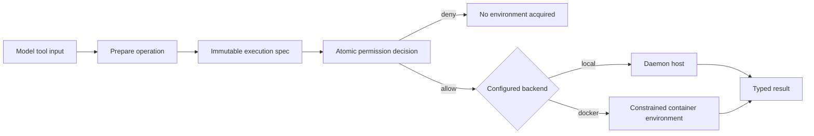

There are two important promises in that model:

1. **No provision before permission.** A denied operation does not create a container, volume, or network.
2. **No widening after permission.** The handler cannot silently change the backend, mounts, network, secrets, limits,
   image, or security generation after approval.

## 3. Terminology

| Term | Meaning |
| --- | --- |
| Backend | The implementation that executes an approved specification: `local` or `docker`. |
| Scope | Docker ownership boundary: `session` or `shared`. |
| Workspace | The primary filesystem exposed at `/workspace`. |
| Grant | An additional configured host mount exposed below `/mnt/<name>`. |
| Exposure | Normalized ambient capabilities: backend, scope, mounts, network, secrets, image, limits, and generation. |
| Operation | One typed command, process action, or filesystem action. |
| Spec | Owner + exposure + operation, normalized and hashed as one immutable execution unit. |
| Environment | Daemon-owned execution resources associated with an effective session or profile. |
| Disposable container | A container created for one foreground command, filesystem operation, or private process. |
| Shared container | A persistent profile-level container used by shared-scope operations without secrets. |
| Security generation | Hash of security-relevant execution and command-policy configuration. |
| Daemon incarnation | Random identity created for one daemon-owned Docker backend lifetime. |
| Container incarnation | Random identity of one concrete persistent/shared or process container. |
| Image contract | Versioned declaration of the sandbox platform, user, PATH, shell, executable identities, and fixed paths. |

## 4. The controls are deliberately separate

Isolation is layered because each control answers a different question.

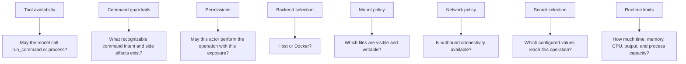

Examples:

- Denying the file `write` tool does not stop an allowed shell command from writing to a writable mount.
- A read-only bind mount blocks writes from both the shell and file tools.
- `network: none` blocks sockets at the container boundary even if command analysis misses a network-capable program.
- `network: bridge` does not mean every remote action is approved. It adds network and external-system effects to the
  permission batch.
- A Docker container does not bypass a denied command, an ownership check, or an approval prompt.
- Full-access permission policy does not select the local backend or add a mount, network, shared scope, or secret.

## 5. Architecture at a glance

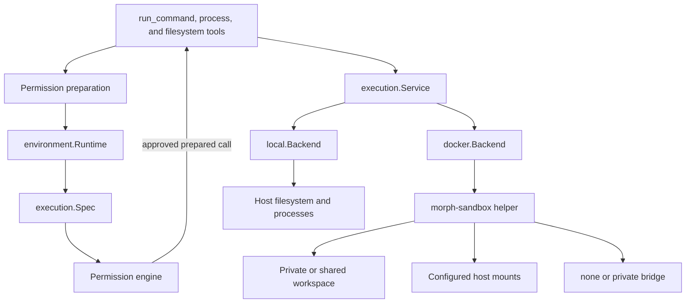

The central interface is [`execution.Service`](../../internal/execution/service.go). It includes:

- environment acquisition and status;
- foreground command execution;
- background process start, status, read, stop, and list;
- file read, write, patch, list, and search;
- owner/session cleanup, reconciliation, and shutdown.

Both backends implement this interface. Tool handlers do not need Docker-specific logic.

## 6. Configuration and safe defaults

The feature is configured under `execution`.

```yaml
execution:
  backend: docker
  docker:
    scope: session
    endpoint: /var/run/docker.sock
    image: ghcr.io/xymorphic/morph-sandbox@sha256:<64-hex-digest>
    imageVerification: signature
    contract: sandbox/contracts/active/<image-digest>-<contract-digest>.json
    workspace:
      mode: none
      source: ""
    mounts: []
    network: none
    secrets: []
    limits:
      memoryBytes: 1073741824
      cpuMilli: 1000
      pids: 256
      openFiles: 1024
      temporaryBytes: 67108864
      outputBytes: 1048576
      controlInputBytes: 1048576
      runtime: 2m
      stopGrace: 3s
    environmentIdleExpiry: 30m
    sharedDisabledRetention: 168h
    maximumEnvironments: 32
    maximumVolumes: 128
    reservedFreeBytes: 2147483648
```

The defaults are intentionally conservative:

| Setting | Default | Consequence |
| --- | --- | --- |
| `execution.backend` | `local` | Compatibility mode; commands are not container-contained. |
| `docker.scope` | `session` | Each effective session gets a distinct workspace identity. |
| `docker.workspace.mode` | `none` | A persistent Docker volume is mounted at `/workspace`; no host project is exposed. |
| `docker.network` | `none` | Containers have no outbound Docker network. |
| mounts | empty | No extra host directories are exposed. |
| secrets | empty | No configured host values are available to commands. |

The configuration implementation lives in
[`internal/config/execution.go`](../../internal/config/execution.go). Environment overrides exist for the backend, scope,
endpoint, image, contract, workspace mode/source, and network mode.

The `contract` value normally points to the profile-local active contract created by `morph sandbox setup`. The path is
stored relative to the profile when possible and resolves to:

```text
<profile>/sandbox/contracts/active/<image-digest>-<contract-digest>.json
```

Do not copy the repository contract into configuration manually for the normal production path. Setup first verifies the
selected image, extracts the contract embedded at `/usr/local/share/morph/contract.json`, preserves the release original,
and activates a separate content-addressed copy for that profile.

### 6.1 Local mode

```yaml
execution:
  backend: local
```

Local mode preserves host behavior. It still uses `execution.Spec` and the backend-neutral service in the normal Morph
runtime, but its filesystem paths and processes resolve on the daemon host. Docker-specific settings have no effect.
`morph doctor` warns that this mode is uncontained.

### 6.2 Private Docker workspace

```yaml
workspace:
  mode: none
  source: ""
```

`none` does not mean “no workspace.” It means “no primary host bind.” Morph creates a persistent scope-owned Docker
volume and mounts it at `/workspace`.

### 6.3 Host workspace

```yaml
workspace:
  mode: ro
  source: /absolute/path/to/project
```

or:

```yaml
workspace:
  mode: rw
  source: /absolute/path/to/project
```

`ro` and `rw` replace the private primary volume with a host bind at `/workspace`. A writable host workspace can change
code or configuration later executed outside the container, so it remains permission-relevant.

### 6.4 Additional grants

```yaml
mounts:
  - name: fixtures
    source: /absolute/path/to/test-fixtures
    mode: ro
    create: false
    purpose: test inputs
```

The container sees this grant at `/mnt/fixtures`. The model cannot supply an arbitrary host source or container target.

## 7. Startup: configuration becomes a backend

At environment startup, Morph performs this sequence:

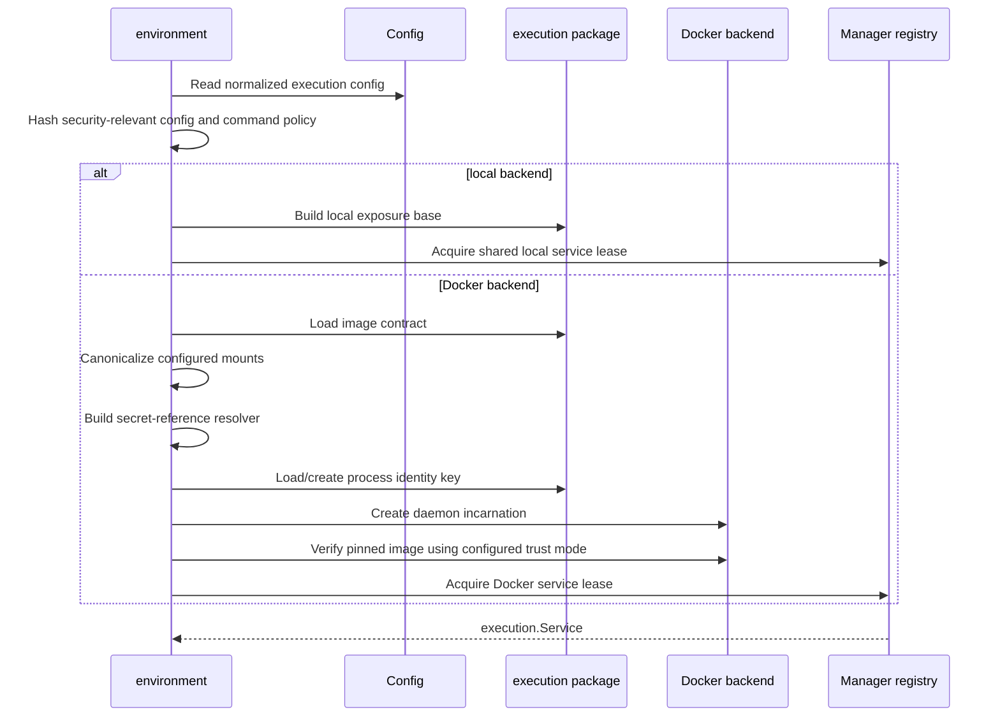

The manager registry shares one backend service between environment instances with the same manager key and closes it
only after the final lease is released. This prevents duplicate daemon-owned resource managers for equivalent runtime
configuration.

For Docker, startup also builds a command target from the image contract. Its PATH and executable map are trusted
sandbox facts, not hints from the daemon host or model input. Command analysis therefore:

1. replaces any supplied PATH with the contract PATH;
2. resolves a bare name such as `pwd` only through the contract executable map;
3. accepts an absolute executable such as `/bin/pwd` only when that exact identity appears in the map;
4. preserves the precise `command executable is absent from the sandbox contract` error when resolution fails.

This prevents authorization from analyzing one host executable while Docker later runs another image executable.
Contract version compatibility is strict: the current runtime accepts version `1`. Changing the contract version without
updating Morph's `SandboxRuntimeCompatibility` makes Docker backend startup fail closed with an unsupported-runtime
error. Contract content changes within a supported version change the contract and exposure digests. A corresponding
new image digest changes the configured security generation as well.

Setup performs the same trust and compatibility work before it changes the profile. Runtime startup repeats the relevant
checks rather than trusting setup as a permanent assertion. This matters if Docker state or profile artifacts are changed
after setup completes.

## 8. The immutable preparation boundary

The most important architectural boundary occurs before permission evaluation.

```mermaid
sequenceDiagram
    participant T as Tool
    participant R as Runtime
    participant P as Path/command preparation
    participant S as Spec builder
    participant A as Permission engine
    participant H as Tool handler
    participant B as Backend

    T->>P: Parse model input once
    P->>R: Prepare typed operation and paths
    R->>R: Derive server-owned owner and exposure
    R->>S: NewSpec(owner, exposure, operation)
    S-->>T: Normalized spec and digest
    T->>A: Command intent + exposure permission inputs
    A-->>H: Approved call carrying prepared spec
    H->>H: Retrieve prepared spec; do not reparse exposure
    H->>B: Execute exact spec
```

### 8.1 Owner

The owner binds execution to:

- profile;
- actor kind and actor ID;
- permission surface;
- public session ID;
- effective state session ID;
- current run ID, when present.

The run ID is useful context but is excluded from the stable owner fingerprint, so later process-control calls in the
same owner/session can address a process started by an earlier run.

### 8.2 Exposure

The exposure contains:

- backend and scope;
- workspace identity and mode;
- canonical mounts and modes;
- network mode;
- selected secret-reference names;
- image and contract digests;
- policy hash and security generation;
- resource and lifecycle limits.

Normalization sorts mount and secret names, validates enum values, and hashes a canonical JSON representation. A change
to any security-relevant field changes the exposure digest.

### 8.3 Operation

An operation is exactly one of:

- a prepared command plan;
- a process action, optionally with a prepared command plan;
- a filesystem action with prepared path identities and typed data.

`Spec` hashes the normalized owner fingerprint, exposure digest, and operation digest. The handler therefore receives a
tamper-evident identity for what was approved.

## 9. Ambient exposure joins the permission decision

Command analysis still describes recognizable command intent. Docker exposure adds separate permission inputs to the
same preparation result.

| Exposure | Added permission meaning |
| --- | --- |
| Docker image/security generation | Execute in this configured execution generation. |
| Read-only host mount | External file read. |
| Writable host mount | External file update plus read/write effects. |
| Workspace/shared mount visibility | Shared-state effect where applicable. |
| Bridge network | Network connection plus external-system effect. |
| Secret reference | Credential-bearing execution. |
| Shared scope | Process management with shared-state effect. |

The entire batch must be allowed. A command cannot be approved while its writable host mount or bridge exposure is
silently omitted.

A container-only working directory is not presented as a host-file read. For example, `cwd: /workspace` with a private
Docker volume contributes no separate host path operation; the Docker process operation and image/security-generation
operation describe the exposure. A configured host bind is still represented by its canonical mount permission. This
keeps an approval from claiming that `/workspace` is a host path when it exists only inside Docker.

The approval transcript is a lifecycle view, not an append-only copy of every trace event. While a request is pending,
its cell may show the remaining response time. Approval, denial, expiry, cancellation, or failure replaces that same
request-ID cell with a terminal state, where the old response deadline is no longer displayed. Delayed pending poll
results cannot move a terminal request backward, and timeline hydration collapses persisted pending and terminal events
into the same current cell. This matters operationally because `Expires: expired` must mean an unanswered request really
expired, not that an already-approved command retained an obsolete countdown.

## 10. Foreground command flow

`run_command` supports direct command mode and POSIX shell mode. "Direct" describes how arguments are passed to the
command; it does not bypass the execution service. Both local and Docker configurations produce an approved `Spec`
and call the selected backend. The tools contain no host-execution fallback. The Docker path is:

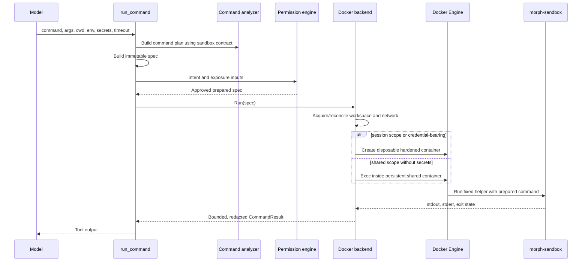

The modes are intentionally different:

| Input | Analysis and execution |
| --- | --- |
| `mode: direct`, `command: pwd` | Resolve `pwd` to `/bin/pwd` from the contract and launch that executable directly. |
| `mode: direct`, `command: /bin/pwd` | Accept only if `/bin/pwd` is an exact contract executable identity. |
| `mode: posix_shell`, `command: pwd` | Launch the contract shell as `/bin/sh -c pwd`; this is indirect execution. |
| `mode: direct`, `command: sh`, `args: ["-c", "pwd"]` | Still indirect execution because the invoked program is a shell. |

The Docker working directory is mapped independently from executable resolution:

- omitted `cwd` defaults to `/workspace`;
- `/workspace` and descendants remain container paths;
- `/mnt/<grant>` and descendants remain configured grant paths;
- a canonical configured host source is translated to its fixed container mount target;
- an absolute path outside all configured mounts is rejected before execution;
- a relative path remains relative to the container's configured working-directory semantics.

The TUI labels direct and shell commands distinctly. It also records permission-approval wait separately from actual
execution duration, so a 45-second approval decision followed by a one-second `pwd` is displayed as a one-second command,
not a 46-second command.

### Cancellation and timeout

For a disposable container, Morph waits for terminal state. If the context is cancelled or times out, it stops and
force-removes the exact container under a fresh bounded cleanup context. The result distinguishes timeout,
interruption, exit status, and OOM state.

For shared execution, Docker cannot reliably kill only one arbitrary exec tree. Morph therefore recreates the shared
container after a foreground interruption or timeout. The persistent workspace survives; ambient processes and
container-installed state do not.

## 11. Filesystem tools share the same view

The read, write, patch, list, and search tools prepare paths and call the same execution service.

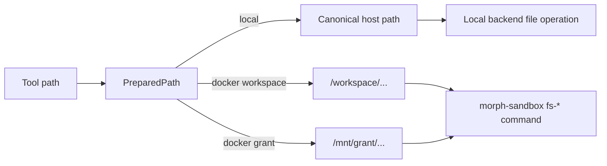

A `PreparedPath` binds:

- the user-visible logical path;
- canonical host identity when local or host-mounted;
- the container-visible path;
- grant name and mount mode;
- filesystem action;
- security generation.

Docker paths must be below `/workspace` or a configured `/mnt/<grant>`. Write and patch preparation rejects read-only
paths before execution. The sandbox helper receives the exact prepared paths; patching also receives an allowlist of
prepared targets, so patch input cannot introduce an unapproved destination.

This parity prevents a confusing and unsafe split such as:

```text
run_command sees a private container volume
write_file secretly changes the daemon host project
```

Instead, both operations see the same workspace.

## 12. Session scope and shared scope

### 12.1 Session scope

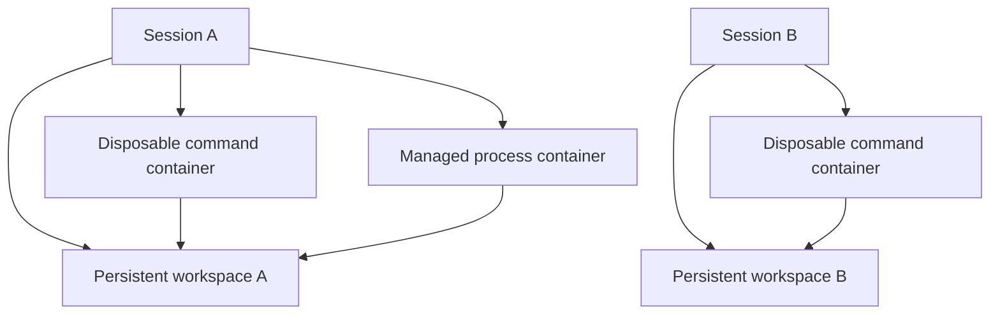

With `workspace.mode: none`:

- each effective session gets a separate persistent volume;
- short commands use disposable containers;
- each background process gets a managed container;
- later turns in the same session see the same files;
- other sessions do not see that volume.

### 12.2 Shared scope

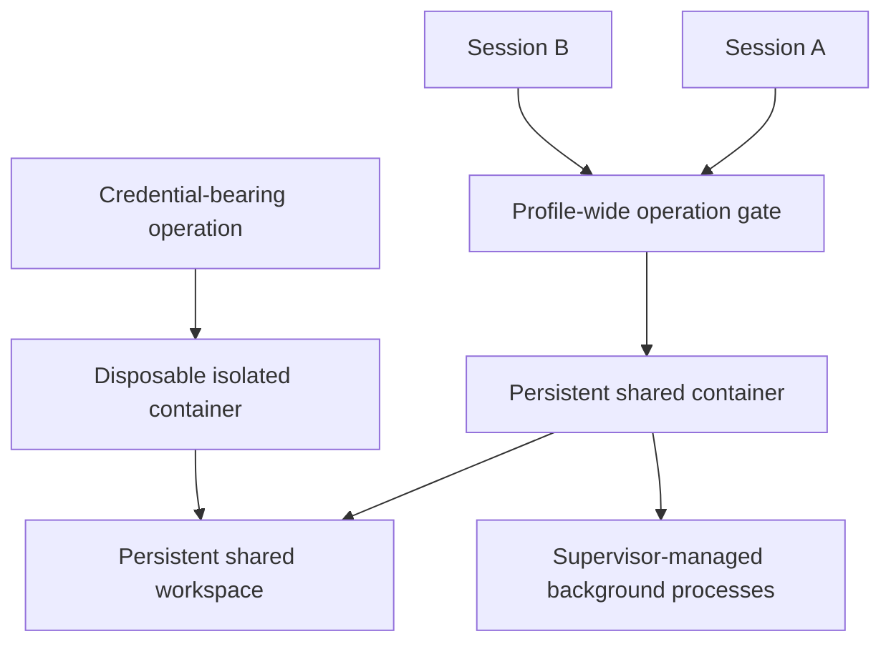

Shared scope deliberately provides profile-wide continuity:

- one persistent container and workspace;
- one ambient process namespace;
- installed state persists in the container until recreation;
- complete foreground, filesystem, and process-control operations are serialized;
- background processes may continue while later operations run;
- a failed safe-stop or foreground cancellation recreates the container.

Credential-bearing operations are the exception: even in shared scope, they run in a disposable container so ambient
shared processes cannot inspect their process environment.

### 12.3 Comparison

| Property | Session scope | Shared scope |
| --- | --- | --- |
| Workspace owner | Effective session | Profile |
| Short command container | Disposable | Persistent shared container |
| Background process | Separate managed container | Supervisor inside shared container |
| Cross-session files | No, unless host mounts make them shared | Yes |
| Cross-session process namespace | No | Yes |
| Foreground concurrency | Independent sessions can run concurrently | Serialized per profile environment |
| Cancellation consequence | Remove only disposable container | Recreate shared container |
| Secrets | Disposable container | Disposable container |

## 13. Container hardening

The Docker backend constructs typed Engine requests; model input cannot supply Docker flags.

Each container uses:

- a pinned image and validated image contract;
- non-root user `65532:65532` from the current contract;
- read-only root filesystem;
- writable bounded tmpfs paths for home, temporary files, and control data;
- all Linux capabilities dropped;
- `no-new-privileges`;
- private mounts with `rprivate` propagation;
- no devices, published ports, Docker socket, privileged mode, or restart policy;
- an init process;
- memory, CPU, PID, open-file, output, control-input, runtime, and stop-grace limits;
- `network: none` unless bridge access is explicitly configured.

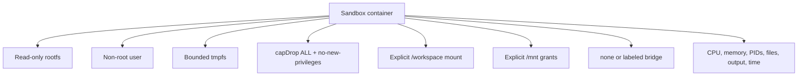

The backend validates the resulting container options before creation. It does not fall back to a root container or the
local backend when Docker cannot satisfy the contract.

## 14. Image contract and supply-chain check

### 14.1 What the contract proves

The sandbox image contains a static `morph-sandbox` helper plus a small executable set. The contract records:

- Linux platform and supported architectures;
- numeric user;
- shell, PATH, and named executable identities;
- helper path;
- workspace, home, temporary, and control paths.

The contract is in
[`containers/sandbox/contract.json`](../../containers/sandbox/contract.json), and the image is built from
[`containers/sandbox/Dockerfile`](../../containers/sandbox/Dockerfile).

The current version `1` contract declares this PATH:

```text
/usr/local/bin:/usr/bin:/bin
```

Its named executable set includes `cat`, `find`, `git`, `mkdir`, `morph-sandbox`, `pwd`, `printf`, `rg`, `sh`, `sleep`.
An executable existing in the image is not enough by itself: direct execution requires the corresponding contract
identity. Adding a program therefore requires rebuilding the image and updating the matching contract; changing the
contract version additionally requires a compatible Morph runtime.

Production startup always requires:

1. an image reference pinned by SHA-256 digest;
2. image OS, architecture, user, and entrypoint matching the contract;
3. the configured contract version matching Morph's runtime compatibility.

The `imageVerification` setting selects who vouches for the pinned digest:

| Mode | Verification |
| --- | --- |
| `signature` | Default. Requires `cosign` and a valid keyless signature from Morph's tagged sandbox-image workflow. |
| `digest` | Skips publisher authentication and trusts the configured digest supplied by the operator. |

Both modes keep the immutable `repository@sha256:<digest>` requirement and Docker's content-addressed manifest/layer
checks. Digest mode does not mean an arbitrary mutable tag is accepted. It means Morph proves that Docker is using the
exact operator-selected bytes and checks their image metadata against the contract, but cannot prove who published them.
`morph doctor` reports this explicit trust transfer as a warning.

The tagged CI workflow builds one multi-platform OCI image index for `linux/amd64` and `linux/arm64`, pushes the release
tag, and signs the immutable index digest with GitHub Actions' OIDC identity. Cosign stores signature material as a
separate OCI object, commonly visible in GHCR under a `sha256-<image-digest>.sig` tag. That signature object has its own
digest; it is not a second digest for the sandbox image.

The workflow also uploads `sandbox-manifest.json`. This small artifact identifies the repository, image digest, release,
architectures, expected runtime compatibility, signature issuer, and signing workflow. It is metadata for configuring
and verifying Morph; it does not contain the image. The local `morph-sandbox:test` tag is accepted only by the explicit
Docker test lane.

### 14.2 Guided setup and the trust boundary

`morph sandbox setup` is the supported path from an unconfigured profile to a usable execution backend. With no complete
flag set it prompts for missing choices; with complete flags it performs the same work without prompts.

When setup is rerun, guided choices prefer the profile's configured backend and image over first-run defaults. Omitted
verification, endpoint, scope, workspace, network, mount, and secret options retain their configured values. If the
immutable image is unchanged, setup validates and preserves the configured active contract, including a compatible
user-managed contract; selecting a different image activates that image's embedded release contract instead.

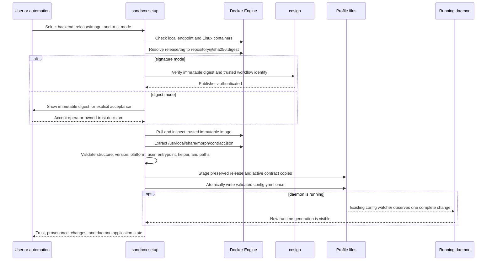

The order is security-relevant: setup verifies or explicitly accepts the image before using its embedded contract as
evidence. A malicious, untrusted image cannot define the shell, helper, or executable identities that Morph will later
authorize merely because it contains a well-formed JSON file.

The modes answer different questions:

- `signature`: “Was this immutable image published through the trusted Morph release workflow?” It requires the user's
  existing `cosign` executable on `PATH`; Morph does not install or download Cosign.
- `digest`: “Did the operator explicitly choose these exact immutable bytes?” It does not authenticate the publisher.

An official release is only a convenient mutable selector. Setup always resolves it to an immutable digest before
writing configuration. In non-interactive digest mode, a digest resolved from `--release` additionally requires
`--accept-digest`; an already immutable `--image repository@sha256:...` is itself the explicit selection.

### 14.3 Contract storage and provenance

Setup stores two independent artifacts beneath the selected profile:

```text
sandbox/contracts/
├── releases/<image-digest>-<original-contract-digest>.json
└── active/<image-digest>-<active-contract-digest>.json
```

The release file is the preserved contract extracted from the trusted image. The active file is the runtime-selected
copy. Both filenames bind their contents by digest, and loading rejects symlinks, non-regular files, and a digest that no
longer matches the filename.

This separation makes provenance honest:

| Image trust | Active contract | Reported meaning |
| --- | --- | --- |
| Signature verified | Same digest as preserved release | Trusted image, release-provided contract. |
| Signature verified | Different digest | Trusted image, user-managed contract. |
| Digest accepted | Same digest as preserved release | Operator-trusted image, image-provided contract. |
| Digest accepted | Different digest | Operator-trusted image, user-managed contract. |

Changing a contract does not erase how the image was trusted, and a valid image signature does not make a later local
contract edit release-authored. Contract and image digests both participate in execution security identity, so a changed
active contract cannot silently reuse old approvals or environments.

### 14.4 Contract lifecycle commands

The contract command group keeps customization profile-local and image-backed:

```bash
morph sandbox contract show
morph sandbox contract validate
morph sandbox contract validate ./candidate.json
morph sandbox contract create \
  --path /usr/local/bin --path /usr/bin --path /bin \
  --output ./candidate.json
morph sandbox contract import --from ./candidate.json
morph sandbox contract edit
morph sandbox contract reset --yes
```

- `show` prints the active contract, digests, validation state, and release/custom provenance.
- `validate` checks the active contract or a candidate. `--structural-only` is diagnostic and cannot activate anything.
- `create` derives facts available from the configured immutable image, then requires confirmation of policy-bearing
  paths and executable declarations that inspection alone cannot make safe. Use `--activate` to select the candidate.
- `import` and `edit` require full structural and trusted image-backed validation before activation.
- `reset` creates a fresh active copy of the preserved release contract; it never edits the preserved original.

Activating a candidate creates another content-addressed active file and atomically changes the configuration pointer.
The prior file is not overwritten in place. This supports rollback and prevents a reader from observing partially written
contract JSON.

### 14.5 Guarded profile editing and live application

`morph config edit` is the general-purpose counterpart for profile YAML. Contract editing and config editing both:

1. snapshot the current regular file and reject symlink targets;
2. open a temporary candidate using `--editor`, then `VISUAL`, then `EDITOR`, then the platform default;
3. validate the complete candidate before replacement;
4. compare the active file with the original snapshot to detect a concurrent edit;
5. atomically replace the active file only when it is still unchanged.

Invalid candidates and editor failures leave the active file untouched. An unchanged edit performs no replacement. On a
successful setup, Morph similarly prepares every Docker, image, contract, and config check first, then writes
`config.yaml` at most once.

Atomic activation is platform-specific beneath this shared contract: Unix uses a same-filesystem rename, while Windows
uses `MoveFileEx` with replace-existing and write-through flags. The caller sees the same validate-before-replace and
concurrent-change behavior on both platforms.

There is no special “restart a daemon” setup API. A running daemon's existing config watcher sees the atomic YAML change,
reloads its services in place, and publishes a new runtime `started_at` generation. Setup waits for that generation when
possible and otherwise reports that the config will apply on the next daemon start. If live observation fails after file
activation, setup retains a recovery snapshot and reports the rollback path.

### 14.6 Host platform note

The sandbox image itself is Linux-only. Morph can run on Windows and connect to a local Docker Desktop Linux Engine over
`//./pipe/docker_engine`, while Unix hosts use an explicit local Unix socket. That does not add Windows-container
support: readiness still requires the Engine and selected image platform to satisfy the Linux contract. In `signature`
mode, `cosign` runs on the daemon host, so Windows installations must provide a Windows `cosign` executable on PATH just
as Unix installations must provide their native executable. Digest mode does not require the Cosign executable.

## 15. Mount safety

Configured host mounts are normalized before they enter an exposure:

1. Require an absolute source.
2. Resolve symlinks through existing ancestors.
3. Optionally derive a canonical missing leaf when `create: true`.
4. Reject overlapping configured sources.
5. Immediately before mounting, create the allowed leaf if requested and resolve it again.
6. Reject the mount if its source changed after authorization.
7. Reject sockets, devices, and protected paths.

Protected examples include Morph state, common credential directories, Docker state/socket locations, and sensitive
system trees such as `/etc`, `/proc`, `/sys`, `/dev`, and `/run`.

This reduces accidental exposure and symlink substitution. It does not claim to defeat a malicious host administrator
who can race and replace mount ancestors; control of the Docker daemon is already host-level authority.

## 16. Network behavior

### No network

`network: none` sets Docker's network mode to none. This is the default and the strongest current arbitrary-command
network control.

### Bridge network

`network: bridge` creates a labeled user-defined network for the environment key, with inter-container communication
disabled and no published ports.

Treat bridge mode as broad outbound exposure. Depending on the Docker host, a command may reach public services, the
host, private networks, link-local endpoints, or metadata services. The current implementation does not claim
destination- or domain-filtered arbitrary command egress.

Browser egress policy remains a separate system and is not implicitly reused for shell sockets.

## 17. Secret delivery and redaction

Configuration maps a logical name to a host environment variable:

```yaml
execution:
  backend: docker
  docker:
    secrets:
      - name: lab-token
        env: MORPH_LAB_TOKEN
        description: Authenticate the lab command
```

The model-visible command schemas list `lab-token` and its description, but not `MORPH_LAB_TOKEN`, its availability,
or its value. The model selects only the logical reference; it cannot name an arbitrary host variable. Morph places no
restriction on which host environment variable backs a configured reference: adding the mapping is an explicit user
decision to make that value available for permission-controlled execution.

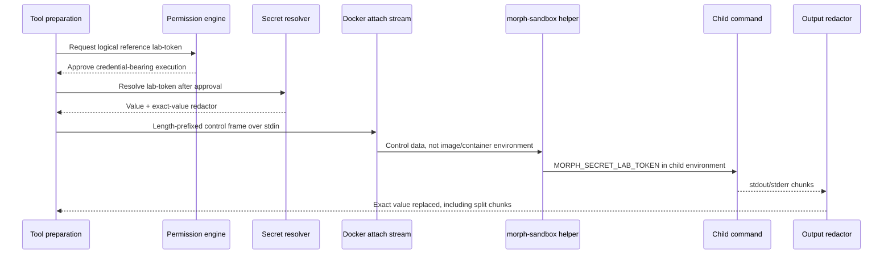

Values do not enter:

- the immutable spec or its digest;
- Docker labels;
- container configuration visible through inspect;
- command arguments;
- durable lifecycle traces.

The streaming redactor handles values split across output chunks and retains bounded output. It cannot prevent an
authorized command from transforming a secret, writing it into the workspace, or deliberately sending it over an
enabled network. Permission remains the primary decision.

## 18. Background processes and authenticated handles

The `process` tool supports `start`, `status`, `read`, `stop`, and `list`.

### 18.1 Session-scope process

A session-scope process receives its own managed container attached to the session workspace. Its stdout and stderr are
stored in bounded buffers. The process container can outlive the turn but not the daemon incarnation.

### 18.2 Shared-scope process

The shared helper supervisor records:

- a random launch token;
- process group and PID;
- OS process start identity;
- output paths and terminal state.

The start identity prevents PID reuse from redirecting a stop request to a different process. If the supervisor cannot
prove that the exact process group stopped, Morph recreates the shared container.

### 18.3 Process ID anatomy

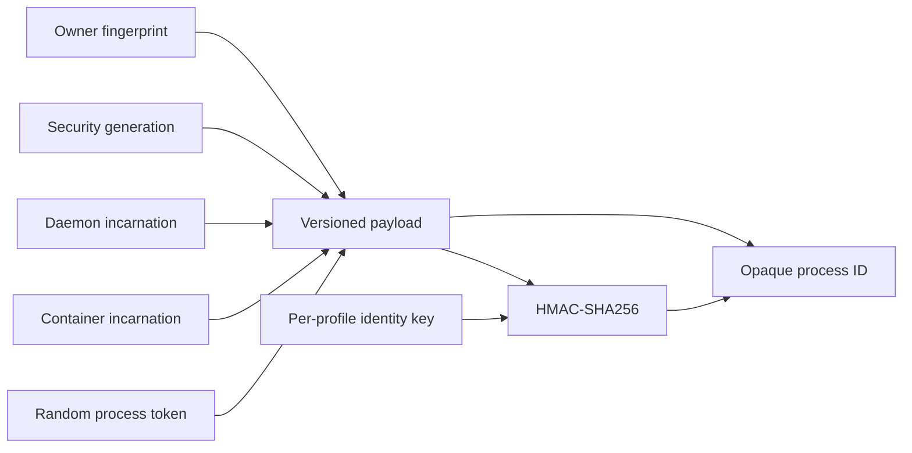

The identity key is created with owner-only permissions and never configured as an execution secret.

Failure classification is intentional:

| Result | Meaning |
| --- | --- |
| `invalid_process_id` | Malformed payload or invalid MAC. |
| `process_access_denied` | Valid handle, wrong owner. |
| `process_stale` | Valid handle from another security, daemon, or container incarnation. |
| `process_not_found` | Valid current identity, but no current tracked process. |

## 19. Generations and incarnations

These identities solve different stale-state problems.

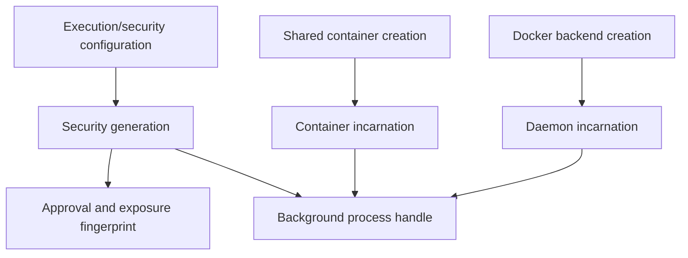

### Security generation

A hash of the selected backend's security-relevant configuration and command policy. Changing mounts, network, image,
scope, secrets, limits, or command posture creates a new generation. Equivalent normalized configuration produces the
same generation.

### Daemon incarnation

A new random value for each Docker backend lifetime. All old process handles become stale after daemon restart even if
configuration is unchanged.

### Container incarnation

A new random value when a persistent/shared or process container is created. Recreation stales handles tied to the old
container without changing workspace identity.

### Workspace identity

Workspace identity intentionally excludes security and daemon generations:

```text
session scope: <profile>:session:<effective-session-id>
shared scope:  <profile>:shared
```

This lets a retained same-scope workspace reattach after restart or security-generation change. Session and shared
workspaces remain separate; switching scope does not merge them.

## 20. Environment lifecycle and reconciliation

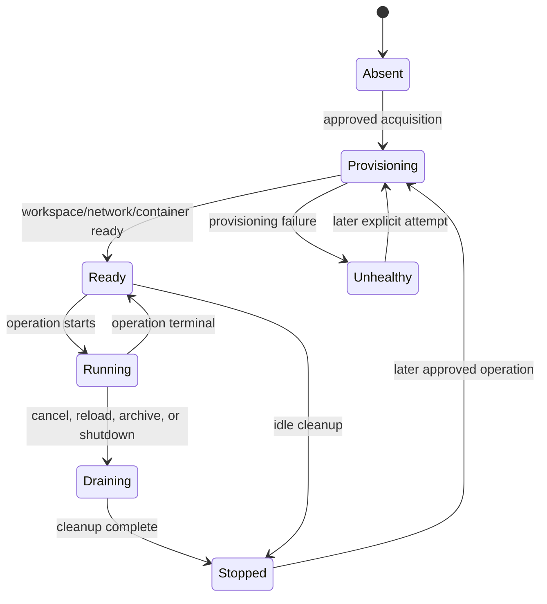

Every Docker resource carries labels for:

- profile;
- scope and scope owner;
- security generation;
- daemon incarnation;
- container incarnation where applicable;
- resource kind.

On first acquisition for a profile, reconciliation lists only resources with that exact profile label. It removes stale
containers and networks from old daemon incarnations. It retains or removes volumes according to session existence,
scope, and shared retention rules. It never performs global Docker prune.

Idle cleanup removes inactive environment state and shared containers when no retained process is running. Workspace
volumes follow longer ownership rules:

- session archive stops execution resources but retains the private workspace;
- session deletion/expiry removes the private workspace;
- a shared workspace is profile-owned and retained while shared-scope retention permits it.

Daemon shutdown stops tracked disposable process containers, removes shared containers and networks, and closes the
Engine client. Persistent workspaces are not broadly deleted.

### Disk admission and `reservedFreeBytes`

Before creating a new Morph workspace volume, the backend checks both the per-profile volume count and the configured
free-space reserve. `reservedFreeBytes` is the minimum Docker-storage capacity that must remain available; its default is
2 GiB. It is an admission threshold, not space preallocated to Morph and not a quota assigned to each workspace.

The check must observe the Docker Engine's storage filesystem. Looking at the Morph daemon host with `statfs` is wrong
when Docker runs in a VM, Docker Desktop, or another storage namespace. Morph therefore uses this order:

1. read `Data Space Available` from Docker Engine information when the storage driver reports it;
2. otherwise create a short-lived, labeled, no-network storage-probe container from the pinned sandbox image;
3. run `morph-sandbox free-space /workspace`, which performs `statfs` inside the Engine's filesystem view;
4. parse the available-byte count and remove the probe container;
5. reject volume creation if the value is below `reservedFreeBytes` or cannot be verified.

The fallback probe is deliberately constrained: non-root contract user, read-only root filesystem, all capabilities
dropped, no network, no restart policy, and no command supplied by the model. This makes disk-pressure admission work
across storage drivers without granting the daemon a host-path guess.

## 21. Inspection and diagnostics

### Setup and contract state

```bash
morph sandbox setup
morph sandbox contract show
morph sandbox contract validate
morph config edit
```

Setup reports its stages separately: endpoint compatibility, release/image resolution, immutable digest, signature or
digest trust result, pull, embedded-contract extraction, contract compatibility, proposed config, activation, and daemon
observation. `--json` provides the same distinctions for automation, but mutation commands require flags that prohibit
interactive prompts. In particular, JSON setup requires `--non-interactive --yes`.

Setup/doctor and `contract show` answer complementary questions: which image is selected, how that image was trusted,
which contract is active, and whether it still matches the preserved release contract. That is more precise than
treating “signed image” as a claim about every later profile-local contract edit.

### Doctor

```bash
morph doctor
```

The execution readiness group reports:

- local mode as an uncontained warning;
- Docker scope, workspace, and network;
- local socket availability and unsafe socket permissions;
- Engine API reachability;
- Linux platform and cgroup support;
- memory, CPU, and PID controls;
- rootless versus rootful daemon trust;
- seccomp and host LSM signals;
- pinned image presence;
- image contract compatibility;
- keyless signature verification or an explicit digest-only trust warning.

### Environment list

```bash
morph sandbox list --session default
```

Output columns are environment ID, backend, scope, and state.

### Environment explanation

```bash
morph sandbox explain --session default <environment-id>
```

Use `--json` for the complete machine-readable view:

```bash
morph sandbox --json explain --session default <environment-id>
```

Inspection travels through the authenticated daemon RPC. The CLI does not open a second independent Docker client.
Session read permission is required. Shared details expose aggregate counts without leaking other session identities or
handles.

### Lifecycle traces

Execution traces include safe metadata such as:

- spec/execution ID;
- backend, scope, operation kind, image, and policy hash;
- mount targets and modes, not sensitive host paths;
- network mode and secret-reference names;
- security generation;
- exit state, duration, output byte counts, timeout, interruption, and safe error;
- environment acquisition, readiness, recreation, and cleanup events.

Raw secret values are excluded.

## 22. Hands-on lab: verify the implementation

The lab progresses from the repository test image and live-Docker lane to supported profile setup, contract lifecycle,
and runtime behavior. Use a disposable profile for configuration experiments.

### 22.1 Prerequisites

- Docker Engine running with Linux containers.
- Go and the repository toolchain installed.
- CGO dependencies required by Morph's SQLite tests.
- For production signature verification: `cosign` and a signed Morph sandbox image digest.
- For digest verification: a trusted compatible image digest; Cosign is not required.

Confirm Docker is reachable:

```bash
docker info
```

### 22.2 Build the local sandbox image

From the repository root:

```bash
make build-sandbox
```

This creates the mutable local tag `morph-sandbox:test` for the explicit test lane. A profile must never store that tag
directly. To exercise setup with this build, first push it to a test registry so it has a repository digest; a purely
local tag has no registry digest and cannot become runtime configuration. A locally built image normally uses the
operator-owned `digest` trust mode rather than claiming a release signature.

Inspect the important image fields:

```bash
docker image inspect morph-sandbox:test \
  --format 'user={{.Config.User}} entrypoint={{json .Config.Entrypoint}} os={{.Os}} arch={{.Architecture}}'
```

Compare the result with `containers/sandbox/contract.json`.

### 22.3 Run the real-Docker integration lane

```bash
make test-execution-docker
```

This lane explicitly enables test-tag image use and verifies that:

1. session A can write a file to its private workspace;
2. session A can read that file in a later disposable operation;
3. session B cannot see session A's file;
4. a foreground command runs inside the sandbox image.

Clean up the local test image when finished:

```bash
docker image rm morph-sandbox:test
```

The test backend cleans its containers and networks. Do not run a broad Docker prune.

### 22.4 Configure a production image with setup

For the guided path, run:

```bash
morph sandbox setup
```

Choose Docker, an official release, and signature verification. Setup checks for a user-installed `cosign` executable
before it resolves and pulls the image. It previews the immutable image reference and conservative defaults before
activation.

The equivalent explicit command is:

```bash
morph sandbox setup \
  --backend docker \
  --release vX.Y.Z \
  --verification signature \
  --yes
```

For automation, disable all prompts and request structured output:

```bash
morph sandbox --json setup \
  --backend docker \
  --release vX.Y.Z \
  --verification signature \
  --non-interactive \
  --yes
```

Setup resolves `vX.Y.Z` to `ghcr.io/xymorphic/morph-sandbox@sha256:<digest>`, verifies the signature, pulls the image,
extracts and validates its embedded contract, writes the profile-local release and active copies, validates the complete
proposed profile, and atomically updates `config.yaml` once.

If you independently trust the exact bytes but do not require publisher authentication, use digest mode:

```bash
morph sandbox setup \
  --backend docker \
  --release vX.Y.Z \
  --verification digest \
  --accept-digest \
  --non-interactive \
  --yes
```

`--accept-digest` is required here because `--release` began as a mutable tag. For a custom image that is already written
as `repository@sha256:<digest>`, select it with `--image` and omit `--accept-digest`:

```bash
morph sandbox setup \
  --backend docker \
  --image registry.example/sandbox@sha256:<64-hex-digest> \
  --verification digest \
  --non-interactive \
  --yes
```

After success, inspect the independent trust and contract facts:

```bash
morph sandbox contract show
morph sandbox contract validate
morph doctor
```

If a daemon is running, setup waits for the config watcher to expose a newer runtime generation. It does not kill and
restart the daemon process. If there is no running daemon, the summary says the change will apply on the next start.
A rootful Docker warning is a trust disclosure, not proof that the runtime is broken.

To switch back without deleting the inactive Docker configuration:

```bash
morph sandbox setup --backend local --yes
```

### 22.5 Exercise contract creation, customization, and reset

First inspect the active and preserved digests:

```bash
morph sandbox contract show
```

Create a candidate from the selected trusted immutable image. The command derives inspectable image facts and asks you to
confirm the policy-bearing fields:

```bash
morph sandbox contract create \
  --path /usr/local/bin --path /usr/bin --path /bin \
  --output ./sandbox-contract.json
morph sandbox contract validate ./sandbox-contract.json
```

The explicit path list narrows Alpine's advertised default `PATH` to directories that actually exist in the sandbox.
If a custom image advertises only existing directories, those overrides may be unnecessary.

Import and activate it only after full image-backed validation:

```bash
morph sandbox contract import --from ./sandbox-contract.json
morph sandbox contract show
```

The second `show` should report `user-managed` if the active digest differs from the preserved release digest. Restore a
fresh active copy of the original without changing the preserved file:

```bash
morph sandbox contract reset --yes
```

For an editor-based exercise:

```bash
morph sandbox contract edit
morph config edit
```

Save an intentionally invalid candidate, such as an unsupported contract version or malformed YAML. Morph should explain
the validation failure and leave the active file unchanged. In a non-interactive test use `--no-retry` so failure exits
instead of offering to reopen the candidate.

### 22.6 Observe private workspace persistence

In session A, ask Morph to use `run_command` or `write_file` to create:

```text
/workspace/session-a.txt
```

with distinctive content. In a later turn in the same session, read it back. The command may run in a new disposable
container, but the volume persists.

Open session B and try to read the same path. It should not exist because session B has a different workspace volume.

Inspect session A's environment:

```bash
morph sandbox list --session <session-a>
morph sandbox explain --session <session-a> <environment-id>
```

### 22.7 Verify filesystem parity

In one session:

1. Create `/workspace/from-command.txt` with `run_command`.
2. Read it with `read_file`.
3. Modify it with `write_file` or `patch`.
4. Read it again with `run_command`.

All four operations should observe one backend filesystem.

### 22.8 Verify a read-only host workspace

Create a disposable test directory outside protected paths, then rerun setup with `--workspace-mode ro` and
`--workspace-source <absolute-path>`. If the daemon is already running, its watcher applies the validated config change
in place.

Expected behavior:

- `read_file` and non-writing commands can inspect `/workspace`;
- `write_file` and `patch` fail during path preparation;
- a shell write fails at the read-only mount boundary;
- the permission presentation includes external host read exposure.

Return to `workspace.mode: none` after the experiment if host visibility is not needed.

### 22.9 Verify network denial

With `network: none`, ask Morph to run a sandbox-contract program that needs outbound access, such as a `git ls-remote`
against an HTTPS repository. The operation should fail to connect.

Rerun setup with `--network bridge` and repeat only in a controlled test profile. Morph should present network and
external-system exposure for authorization. Bridge mode is broad outbound access, not destination filtering.

### 22.10 Verify a background process

Ask the `process` tool to:

1. start a labeled `sleep` process;
2. list processes;
3. query status by returned process ID or label;
4. read its incremental stdout/stderr cursors if it produces output;
5. stop it;
6. confirm terminal status.

Restart the daemon and retry the old opaque ID. It should be classified as stale rather than controlling a new process.

### 22.11 Verify secret redaction

Use a dedicated non-sensitive lab value:

```bash
export MORPH_LAB_TOKEN='lab-secret-value-123'
```

Configure:

```yaml
secrets:
  - name: lab-token
    env: MORPH_LAB_TOKEN
    description: Authenticate the lab command
```

Ask `run_command` to select `lab-token` and print `MORPH_SECRET_LAB_TOKEN`. After approval, output should contain
`[REDACTED]`, not the value. Repeat with a command that writes the value in several chunks to confirm streaming
redaction.

Delete any workspace file containing the lab value manually. Redaction does not clean command-created workspace
residue.

### 22.12 Observe shared scope carefully

Use a disposable profile and set:

```yaml
scope: shared
workspace:
  mode: none
```

From two sessions in that profile:

1. Create a file from session A.
2. Read it from session B.
3. Start a background process and inspect aggregate environment counts.
4. Interrupt a long foreground command.
5. Confirm the shared container incarnation changes while the shared workspace file remains.

This demonstrates the difference between persistent workspace state and replaceable container/process state.

## 23. Common failures and what they mean

| Symptom | Likely cause | What to check |
| --- | --- | --- |
| `execution backend is not configured` | Runtime or test double does not expose `execution.Runtime`. | Environment construction and tool runtime wiring. |
| Docker endpoint rejected | TCP, SSH, context, relative socket, or unsupported endpoint. | Use an explicit local Unix socket or named pipe. |
| Setup reports unsafe Docker socket permissions | The local socket grants broader daemon control than the supported trust posture. | Fix socket ownership/mode; setup will not weaken the check. |
| Image must be pinned | Mutable tag supplied in production config. | Use `repository@sha256:<digest>`. |
| `manifest unknown` while pulling | Digest was written as a tag, commonly `:sha256-...`, or the digest is from the cosign signature object. | Build `repository@digest` from `sandbox-manifest.json`; do not use the `.sig` artifact digest. |
| Setup cannot resolve or pull the image | Release does not exist, registry access failed, or private GHCR authentication is missing. | Authenticate the selected Engine/registry and retry setup; no profile mutation has occurred. |
| `cosign is required` | Production signature verifier unavailable. | Install `cosign` on daemon host. |
| Signature verification failed | The immutable image has no trusted signature or its workflow identity/issuer does not match. | Do not activate it as signature-verified; choose the correct release or make a deliberate digest-mode decision. |
| `--accept-digest is required` | Non-interactive digest mode resolved a mutable `--release` tag. | Inspect the displayed immutable digest, then repeat with `--accept-digest` if it is the intended trust anchor. |
| Signature verification is disabled | `imageVerification: digest` explicitly delegates image provenance to the configured digest. | Confirm the digest through a trusted channel or return to `signature`. |
| Image contract mismatch | Wrong platform, user, entrypoint, or stale contract. | Inspect image and compare contract digest and fields. |
| Unsupported sandbox runtime compatibility | Contract version differs from Morph's supported runtime version. | Use the matching image/contract or update Morph and rebuild the image together. |
| Stored contract digest mismatch | Active or preserved contract bytes no longer match the content-addressed filename. | Do not edit stored artifacts in place; import/edit a validated candidate or reset from the preserved release contract. |
| Contract path is a symlink or non-regular file | Profile artifact was replaced with an unsafe filesystem object. | Restore a regular profile-local contract through setup or reset. |
| Contract mutation rejects `--structural-only` | Structural validation cannot prove compatibility with the selected runtime image. | Use full image-backed validation for create/import/edit/reset; reserve `--structural-only` for non-mutating diagnosis. |
| Config or contract changed while editor was open | The guarded compare-and-swap detected a concurrent writer. | Reopen the latest file and reapply the intended change instead of overwriting it. |
| Setup activated files but did not observe daemon application | The watcher did not publish a newer runtime generation before timeout or rejected application. | Read the reported recovery path, inspect daemon logs/status, and restore the snapshot if necessary. |
| Command executable absent from contract | Direct command name or absolute path is not enumerated, even if a binary happens to exist in the image. | Use a declared executable or deliberately update the image contract and image. |
| Docker working directory outside configured mounts | Absolute `cwd` is neither `/workspace`, `/mnt/<grant>`, nor a configured canonical host source. | Omit `cwd`, use a container-visible mounted path, or configure an explicit mount. |
| Mount source protected | Source enters system, credential, Morph-state, or Docker-control path. | Select a dedicated non-sensitive directory. |
| Mount source changed after authorization | Symlink or canonical path changed before create. | Stabilize the configured source and retry explicitly. |
| Path does not map to a grant | Docker path is outside `/workspace` and configured `/mnt` roots. | Use a configured logical grant. |
| Path is read-only | Write/patch requested through a `ro` mapping. | Change operation or explicitly reconfigure mount mode. |
| Docker backend unavailable | Daemon stopped or socket inaccessible. | Run `docker info` and `morph doctor`; no local fallback occurs. |
| Environment/volume limit reached | Profile resource admission bound reached. | Stop unused work; allow idle cleanup; inspect environments. |
| Disk-pressure admission | Creating a volume would leave less than `reservedFreeBytes`. | Free Docker storage deliberately or choose an intentional threshold; do not broad-prune blindly. |
| Docker free-space reserve cannot be verified | Engine storage information is absent and the sandbox storage probe failed or returned invalid output. | Confirm the pinned image contains the matching `free-space` helper, then inspect Docker health and probe-container errors. |
| `invalid_process_id` | Handle malformed or MAC invalid. | Use the exact returned ID or current label. |
| `process_access_denied` | Another owner/session supplied a valid handle. | Control it from its owning session. |
| `process_stale` | Daemon, security, or container incarnation changed. | Start a new process and use its new ID. |
| Shared container recreated | Foreground cancellation, unsafe process stop, or container failure. | Expect workspace persistence but process/container state loss. |

## 24. Testing map

| Layer | Representative coverage |
| --- | --- |
| Spec normalization | Exposure and operation fields change the expected digest. |
| Owner/process identity | Owner scoping, invalid MAC, stale generation/incarnation, and wrong-owner classification. |
| Manager lifecycle | Shared service closes after its final lease. |
| Container construction | Non-root, read-only rootfs, no capabilities, clean environment, limits, mounts, stdin lifecycle. |
| Command target | Contract PATH, bare-name/absolute resolution, direct-versus-shell mode, CWD mapping, and precise lookup failures. |
| Resource admission | Engine-reported capacity, in-engine free-space probe, reserve rejection, probe cleanup, and volume bounds. |
| Approval lifecycle | Terminal-state monotonicity, hydrated request indexing, replay collapsing, and stale-expiry removal. |
| Output | Cross-chunk exact-value redaction, truncation, and byte accounting. |
| Local backend | Filesystem search recursion, regex, and hidden-file behavior. |
| Sandbox helper | Patch allowlisting and OS process start identity. |
| Setup orchestration | Prompt-free JSON rules, local/Docker flag separation, idempotence, timeout validation, and daemon-generation observation. |
| Contract store | Release/active separation, provenance, reset, immutable image requirement, symlink rejection, and filename/content digest checks. |
| Contract commands | Show/import/reset lifecycle, full activation validation, structural-only mutation rejection, and non-prompting automation rules. |
| Guarded file editing | Candidate validation, unchanged edits, concurrent-change rejection, symlink defense, atomic replacement, and Windows path parsing. |
| Config editing | Complete config validation, invalid-candidate preservation, no-op behavior, and compare-and-swap conflict handling. |
| Live Docker | Private workspace persistence, cross-session isolation, command execution. |

Run the ordinary suite with the repository's required SQLite settings:

```bash
make test
make lint
```

Run the explicit Docker lane only when Docker is available:

```bash
make build-sandbox
make test-execution-docker
```

CI mirrors this split in [`.github/workflows/tests.yml`](../../.github/workflows/tests.yml): the `General` job runs
`make test`, while `Docker E2E` builds `morph-sandbox:test` and runs `make test-execution-docker` against the runner's
Linux Docker Engine. The live provider-backed test lane is intentionally not part of this deterministic workflow.

## 25. Source map

| Concern | Implementation |
| --- | --- |
| Core types and service | [`internal/execution/types.go`](../../internal/execution/types.go), [`service.go`](../../internal/execution/service.go) |
| Immutable exposure/spec | [`internal/execution/spec.go`](../../internal/execution/spec.go) |
| Prepared paths | [`internal/execution/path.go`](../../internal/execution/path.go) |
| Owner and process handles | [`internal/execution/identity.go`](../../internal/execution/identity.go) |
| Runtime/backend wiring | [`internal/environment/environment.go`](../../internal/environment/environment.go), [`runtime.go`](../../internal/environment/runtime.go) |
| Permission integration | [`internal/tools/common/execution.go`](../../internal/tools/common/execution.go) |
| Command analysis and Docker target | [`internal/tools/common/command.go`](../../internal/tools/common/command.go), [`internal/execution/runtime.go`](../../internal/execution/runtime.go) |
| Local backend | [`internal/execution/local`](../../internal/execution/local) |
| Docker acquisition and foreground execution | [`internal/execution/docker/container.go`](../../internal/execution/docker/container.go) |
| Shared execution | [`internal/execution/docker/shared.go`](../../internal/execution/docker/shared.go) |
| Background processes | [`internal/execution/docker/process.go`](../../internal/execution/docker/process.go) |
| Filesystem helper routing | [`internal/execution/docker/filesystem.go`](../../internal/execution/docker/filesystem.go) |
| Container hardening | [`internal/execution/docker/config.go`](../../internal/execution/docker/config.go) |
| Mount checks | [`internal/execution/docker/mounts.go`](../../internal/execution/docker/mounts.go) |
| Secret resolution/redaction | [`internal/execution/docker/secrets.go`](../../internal/execution/docker/secrets.go), [`internal/guardrails/exact_value_stream.go`](../../internal/guardrails/exact_value_stream.go) |
| Cleanup and reconciliation | [`internal/execution/docker/reconcile.go`](../../internal/execution/docker/reconcile.go) |
| Volume and free-space admission | [`internal/execution/docker/resources.go`](../../internal/execution/docker/resources.go) |
| Sandbox helper/image | [`cmd/morph-sandbox`](../../cmd/morph-sandbox), [`containers/sandbox`](../../containers/sandbox) |
| Sandbox publishing and signing | [`.github/workflows/sandbox-image.yml`](../../.github/workflows/sandbox-image.yml) |
| Guided backend setup | [`cmd/sandbox/setup.go`](../../cmd/sandbox/setup.go) |
| Contract management CLI | [`cmd/sandbox/contract.go`](../../cmd/sandbox/contract.go) |
| Profile-local contract store and provenance | [`internal/execution/contract_store.go`](../../internal/execution/contract_store.go) |
| Guarded atomic editing | [`internal/fileedit`](../../internal/fileedit) |
| General config editing | [`cmd/morph/configcmd/config.go`](../../cmd/morph/configcmd/config.go) |
| Atomic config updates | [`internal/config/set_config.go`](../../internal/config/set_config.go) |
| Daemon runtime-generation metadata | [`internal/runtime/runtime.go`](../../internal/runtime/runtime.go) |
| General and Docker CI | [`.github/workflows/tests.yml`](../../.github/workflows/tests.yml) |
| Diagnostics | [`internal/diagnostics/readiness/execution.go`](../../internal/diagnostics/readiness/execution.go) |
| Operator CLI | [`cmd/sandbox/sandbox.go`](../../cmd/sandbox/sandbox.go) |
| TUI approval lifecycle | [`internal/tui/app/transcript.go`](../../internal/tui/app/transcript.go), [`timeline.go`](../../internal/tui/app/timeline.go) |
| Live Docker test | [`internal/e2e/tests/execution/docker_test.go`](../../internal/e2e/tests/execution/docker_test.go) |

## 26. Core invariants to remember

1. Authorization and isolation are complementary, not interchangeable.
2. Permission preparation freezes operation and exposure before approval.
3. Denial provisions nothing and Docker failure never falls back to host execution.
4. Commands and filesystem tools observe the same backend filesystem.
5. Private workspace is the Docker default; it is persistent but not a host bind.
6. Network, host mounts, secrets, and shared state are independently explicit and permission-bearing.
7. Secret values are resolved after approval and omitted from inspect-visible configuration.
8. Credential-bearing work is disposable even in shared scope.
9. Process handles bind owner, security generation, daemon incarnation, and container incarnation.
10. Shared foreground cancellation recreates the container because an arbitrary exec tree cannot be safely isolated.
11. Workspace identity survives same-scope generation/restart changes; process handles do not.
12. Cleanup uses exact labels and ownership—never global Docker prune.
13. Docker command identity comes from the versioned sandbox contract, never the daemon host PATH.
14. Container-only working directories do not invent host-file permissions; configured host mounts remain explicit.
15. New workspace volumes are admitted against Docker-visible free space, not the Morph host filesystem view.
16. Image trust and contract provenance are independent facts; one never implies the other.
17. Runtime configuration always uses an immutable image digest and a validated content-addressed active contract.
18. Setup verifies trust before extracting an embedded contract and validates every artifact before one atomic config write.
19. Preserved release contracts are never edited; customization creates a separate profile-local active artifact.
20. Contract activation requires image-backed validation; structural-only validation is diagnostic, not authority.
21. Guarded edits validate candidates, reject concurrent changes, and leave active files untouched on failure.
22. Setup relies on the existing config watcher and observes a new runtime generation; it does not restart the daemon process.

If these invariants are clear, the rest of the system becomes much easier to reason about: Morph first decides what may
happen, then constrains where and with which ambient capabilities it can happen, and finally preserves enough identity
and lifecycle evidence to stop stale work from becoming current authority.
