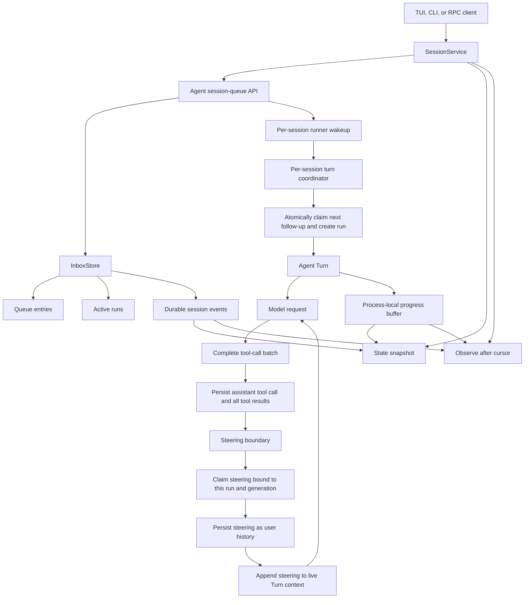
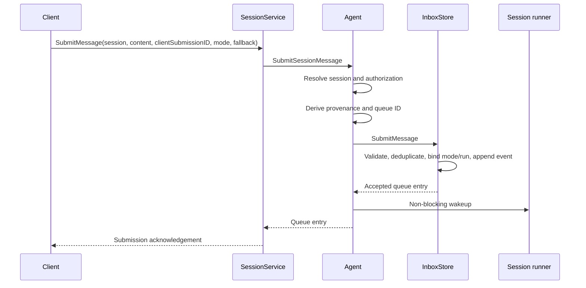
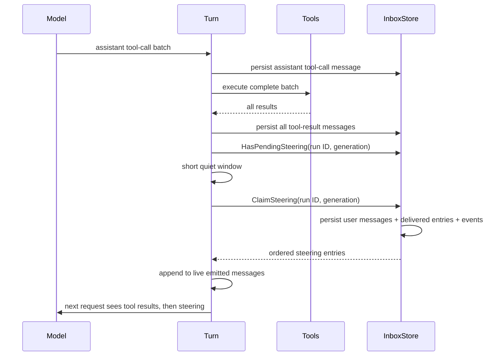
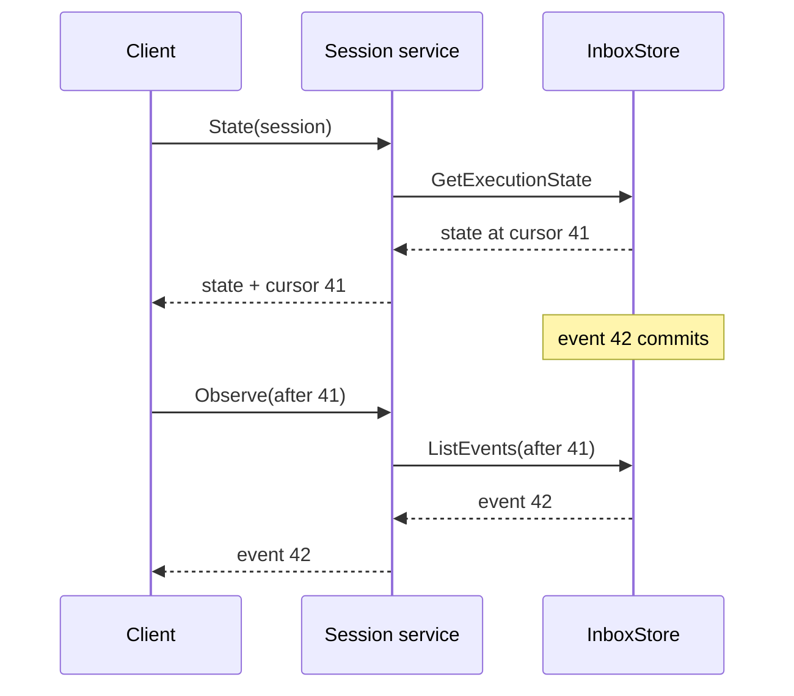
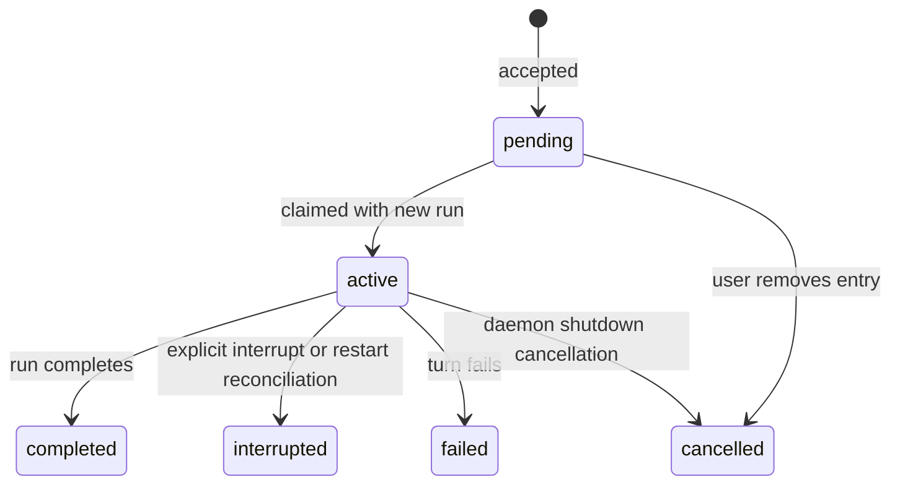
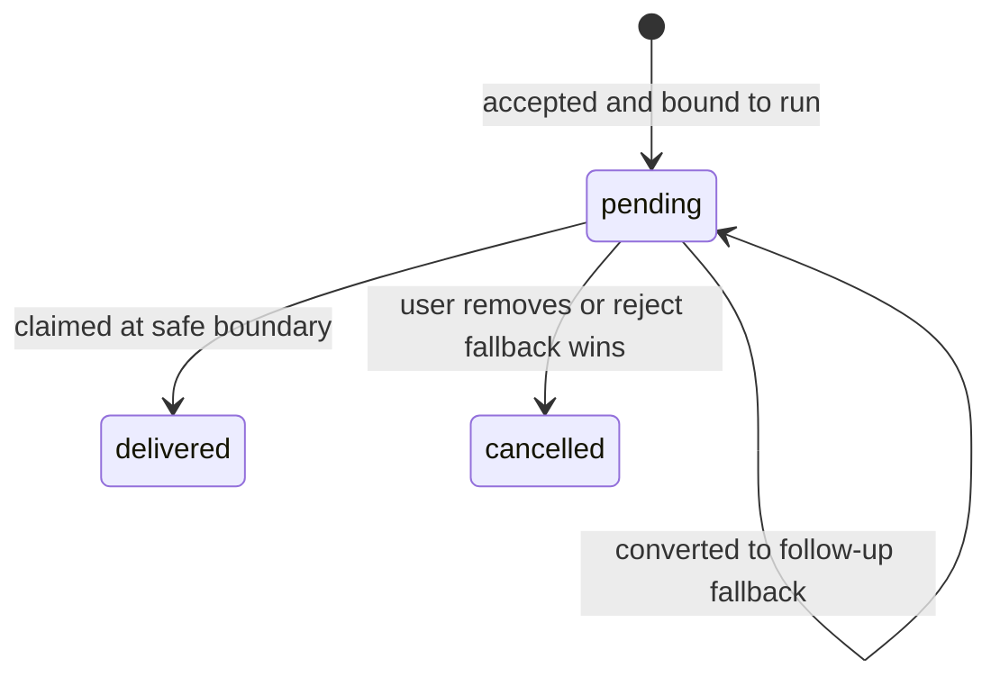
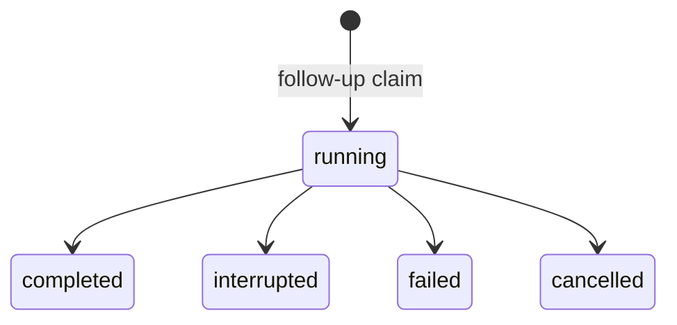

# Morph Session Message Queue Study Guide

## 1. Why this document exists

This guide explains how Morph accepts messages while a session is already working, how it decides whether a message
belongs in the current turn or a later turn, how interruption differs from steering, and how clients reconnect without
becoming the owner of agent execution.

The main questions are:

- What is actually queued?
- Why are follow-up and steering separate delivery modes?
- Where is the safe boundary for steering?
- What happens when steering races with run completion?
- What does interruption stop, and what does it preserve?
- How can a TUI disconnect without cancelling accepted work?
- How do SQLite and memory storage implement the same inbox contract?
- How do `State` and `Observe` avoid a state-to-stream gap?
- How does the TUI let a user inspect, promote, edit, and remove pending messages?
- Which guarantees are durable, and which are intentionally process-local?

This is a study guide rather than only an API reference. It builds a mental model, follows each delivery path, explains
the invariants that protect tool-call history, and points to the implementation and tests responsible for them.

## 2. The shortest useful mental model

> A session owns an inbox and at most one active run. Follow-ups become later turns. Steering may join the current turn
> only after a complete tool batch and its results have been persisted. Interruption stops the active run but does not
> silently discard the remaining inbox.

The client submits intent; it does not own execution:

```text
client submission
    │
    ▼
session-owned inbox
    │
    ├─ follow-up ──► next isolated run when the session is idle
    │
    └─ steering ───► current run at a safe post-tool boundary

explicit interrupt ──► terminal active run; pending follow-ups remain queued
```

This changes the old request-owned model. A client no longer keeps an agent turn alive merely by holding open a
response RPC. Submission is acknowledged after the queue entry is accepted, while observation is a separate,
replaceable activity.

## 3. Terminology: follow-up, steering, interception, and interruption

The implementation has two delivery modes and one separate control operation:


| Term      | Meaning                                                                      | Starts a new turn? | Changes the active run? |
| --------- | ---------------------------------------------------------------------------- | ------------------ | ----------------------- |
| Follow-up | A queued user message that waits until no run is active                      | Yes                | No                      |
| Steering  | A message bound to one active run and delivered after a persisted tool batch | No                 | Yes                     |
| Interrupt | A control request that terminates the active run                             | No                 | It stops it             |


“Intercept” is not a third queue mode in the domain model.

If interception means “change what the active run should do,” the mechanism is **steering**. If it means “stop the
active run now,” the mechanism is **interruption**. Keeping these meanings separate prevents a generic message from
silently cancelling work.

## 4. Architecture at a glance




The important ownership boundaries are:

1. `SessionService` exposes submission, state, observation, mutation, and interruption.
2. The agent API resolves session identity and records server-derived provenance.
3. `InboxStore` owns queue ordering, active-run state, cursor progression, and race-safe transitions.
4. One daemon-lifetime runner coordinates work for each runnable session.
5. A `Turn` owns the live model context for one follow-up.
6. Observers consume state; they do not own the runner or its cancellation context.


## 5. The domain objects


### Queue entry

A queue entry records more than message text:


| Field group | Purpose                                                              |
| ----------- | -------------------------------------------------------------------- |
| Identity    | Queue ID, session ID, and client submission ID                       |
| Content     | Message text plus optional instruction and stream override           |
| Delivery    | Requested mode, effective mode, steering fallback, and target run ID |
| Ordering    | Immutable sequence and mutable promotion priority                    |
| Lifecycle   | Status and created, updated, started, and completed times            |
| Provenance  | Actor, surface, surface kind, and profile derived by the server      |
| Diagnostics | Last safe error or terminal reason                                   |


`RequestedDeliveryMode` and `DeliveryMode` are intentionally distinct. A client may request steering while no active run
exists. With follow-up fallback, the stored entry remembers that steering was requested but makes its effective
delivery mode `follow_up`.

### Active run

An active run connects one claimed follow-up to one execution:

```text
run ID
session ID
queue entry ID
runner generation
status
timestamps
terminal reason or error
```

The run is not the observer stream and is not the client request. It is daemon-owned work with an explicit lifecycle.

### Session event

A session event is a durable, cursor-ordered description of a queue or run transition. Examples include:

- queue enqueued, updated, cancelled, or claimed;
- steering delivered;
- run started, completed, interrupted, failed, or cancelled.

The event carries a snapshot of the affected queue entry or run. It is the replay source used after reconnection.

### Progress event

Progress events carry streaming assistant or reasoning deltas. They are deliberately different from durable state
events:

- queue and run events are stored by the inbox and have a durable session cursor;
- progress is kept in a bounded in-process history and has a separate sequence;
- a daemon restart can preserve SQLite queue/run state but cannot preserve process-local progress deltas;
- the final transcript remains authoritative after the run persists its messages.


## 6. Core invariants

The design depends on these invariants:

1. A session has at most one running active run.
2. Only a follow-up can create a run.
3. Claiming a follow-up and creating its run is one storage transition.
4. Follow-ups are selected by priority descending, then immutable sequence ascending.
5. Steering is bound to the active run ID at acceptance.
6. Steering delivery also checks the daemon runner generation.
7. Steering becomes model-visible only after the entire tool batch and all results are persisted.
8. A client submission ID is idempotent within its session.
9. Queue/run mutations and their replay events are committed together.
10. Disconnecting an observer does not cancel the active run.
11. Interruption is explicit and does not cancel unrelated pending entries.
12. A stale daemon generation cannot claim work or finish a current run.

These rules are enforced in both the memory and SQLite inbox implementations, not reconstructed by the TUI.

## 7. Submission from client to durable acceptance

The general submission path is:




Acceptance does not mean completion. It means the inbox has accepted a specific, inspectable entry.

For SQLite, the entry and enqueue event are committed in a transaction before success is returned. For memory storage,
the same transition is protected by the store mutex, but the result survives only as long as that store instance.

### Idempotency

The client generates a `client_submission_id`. Repeating the same submission with the same ID returns the existing
entry. Reusing that ID for different content or delivery settings is rejected.

This addresses the lost-acknowledgement case:

```text
server accepts entry
network loses response
client retries same submission ID
server returns original entry instead of adding a duplicate
```

Idempotent acceptance does not imply exactly-once external effects inside a tool. A daemon can still fail after an
external tool side effect but before all resulting state is persisted.

## 8. Follow-up lifecycle

A follow-up is a complete future turn, not extra text appended to the active prompt.

```mermaid
sequenceDiagram
    participant C as Client
    participant S as InboxStore
    participant R as Session runner
    participant T as Turn
    participant M as Model

    C->>S: Submit follow-up
    S-->>C: pending entry
    R->>S: ClaimNextFollowUp(run ID, generation)
    alt another run is active
        S-->>R: not claimed
    else session is idle
        S->>S: entry = active; create running run
        S-->>R: claimed entry and run
        R->>T: Run(entry content)
        T->>M: independent model turn
        M-->>T: final response
        T-->>R: completed or failed
        R->>S: FinishSessionRun
        S->>S: terminal entry + terminal run + events
    end
```


The runner repeatedly claims one follow-up, waits for that run to finish, then checks the inbox again. Independent
follow-ups are never merged into one prompt.

Promotion changes priority rather than sequence. This lets a user choose the next pending follow-up without erasing
the original arrival order or changing the identity of any message.

## 9. Steering lifecycle and the safe boundary

Steering exists to correct an active, tool-using run without corrupting the model conversation.

The dangerous shape would be:

```text
assistant asks to call tools
user message appears before all tool results
model history no longer has a valid assistant-tool-result sequence
```

Morph instead places the steering callback after these steps:

1. Persist the assistant message containing the complete tool-call batch.
2. Execute the complete batch.
3. Append every tool-result message to the live turn.
4. Persist every tool-result message.
5. Check for steering bound to this exact run and generation.
6. Wait a short quiet window so adjacent steering submissions can be collected.
7. Atomically claim all matching steering entries in arrival order.
8. Persist each steering message as durable user history.
9. Append each message to the live turn's emitted-message context.
10. Start the next model request from the updated context.




Both persistence and live-context injection are necessary:

- persistence makes steering part of durable conversation history;
- live injection makes the already-running `Turn` see it immediately;
- a later summary refresh or context rebuild can still recover it from persisted history.


### The no-tool-boundary edge case

Steering is not an arbitrary mid-generation interrupt. If the active run goes directly from a model request to a final
answer, there is no safe post-tool boundary at which to inject the message.

When the run becomes terminal, pending steering bound to it is resolved by fallback:

- `follow_up`: clear the target run and convert the entry to an effective follow-up;
- `reject`: cancel the entry with `target run completed before steering delivery`.

The TUI's `/steer` command uses follow-up fallback, so a correction is preserved as later work when it misses the
active run.

## 10. Why steering is bound to a run ID

Binding steering only to “whatever run is active later” creates a race:

```text
client observes run A
client submits steering
run A completes
runner starts run B
steering accidentally enters run B
```

Morph captures run A's ID when accepting the steering entry. Delivery requires:

- the same session;
- the same run ID;
- the same runner generation;
- a still-running run;
- a pending steering entry targeting that run.

If any of those checks fail, the message cannot silently attach to a successor.

## 11. Interruption and cancellation semantics

Interruption is a separate RPC and user action.

The flow is:

1. Load authoritative session state.
2. If there is no active run, report no transition.
3. Transition the active run to `interrupted` with reason `user_interrupt`.
4. Transition its active queue entry to the corresponding terminal state.
5. Cancel the in-process run context with an interruption cause.
6. Wake the session runner.
7. Leave unrelated pending follow-ups in the inbox.

The runner can therefore continue with the next follow-up after the interrupted turn settles.

This differs from observer cancellation:


| Action                                     | Active run                                   | Pending queue                             | Observer                         |
| ------------------------------------------ | -------------------------------------------- | ----------------------------------------- | -------------------------------- |
| Cancel `Observe` context                   | Continues                                    | Preserved                                 | Detached                         |
| Close or reconnect TUI                     | Continues                                    | Preserved                                 | Replaced                         |
| Press Escape during an active TUI response | Requests run interruption                    | Preserved                                 | Current response state resets    |
| Run `/interrupt`                           | Explicitly requests run interruption         | Preserved                                 | May remain attached or rehydrate |
| Daemon shutdown                            | Run becomes cancelled if it settles          | Pending entries remain in durable storage | Ends                             |
| Restart reconciliation                     | Old run becomes `daemon_restart` interrupted | Pending follow-ups remain                 | Rehydrates                       |


The system intentionally does not retry an interrupted or abandoned active entry automatically. Its tools may have
performed external effects whose completion is unknown.

## 12. Runner ownership and generation fencing

The agent starts a daemon-lifetime queue runtime with a new generation ID.

At startup it:

1. reconciles nonterminal runs from an older generation;
2. marks them interrupted with reason `daemon_restart`;
3. lists sessions that still contain runnable follow-ups;
4. starts one in-process runner per such session.

Each per-session runner has a buffered wake channel. Submission and successful mutations perform a non-blocking wake.
Before claiming, the runner also acquires the existing per-session turn coordinator, preserving serialization with
other turn paths.

Storage checks the current generation during claim and terminal transitions. Work from a stale runner cannot mutate
the generation that now owns the store.

This is a single-daemon design. The generation fence protects stale work in the supported ownership model; it is not a
multi-daemon lease or distributed consensus protocol.

## 13. State hydration and gap-free observation

Clients recover using two operations:

```text
State(session)
    -> active run
    -> queue snapshots
    -> durable cursor
    -> retained cursor floor
    -> recent process-local progress

Observe(session, afterCursor)
    -> replay durable events strictly after cursor
    -> continue following new durable events and live progress
```

The client must use the cursor returned with the state snapshot:




An event committed between `State` and `Observe` is replayed because it has a later cursor. The client does not need to
attach atomically to a live channel.

Durable events retain at least the newest 10,000 events and events from the last seven days. If a requested cursor is
older than the retained floor, observation returns a failed precondition and the client must call `State` again. A
cursor beyond the session cursor is also rejected.

Recent progress is bounded to 256 events per session in the agent process. If progress history needed by an observer
has expired, the observer rehydrates. Durable transcript messages are the eventual source of truth.

## 14. RPC contract

The session queue is exposed through `SessionService`:


| RPC                    | Role                                                            |
| ---------------------- | --------------------------------------------------------------- |
| `SubmitMessage`        | Accept a follow-up or steering entry                            |
| `State`                | Return authoritative queue/run state and the observation cursor |
| `Observe`              | Replay and follow session events after a cursor                 |
| `EditQueuedMessage`    | Change the content of a pending entry                           |
| `RemoveQueuedMessage`  | Cancel a pending entry                                          |
| `PromoteQueuedMessage` | Raise a pending entry's priority                                |
| `InterruptRun`         | Explicitly terminate the active run                             |


`State` requires `read` access to the target session, and reasoning-effort updates require `update` access. Custom
permission policies must allow those operations explicitly; otherwise the server rejects the request without reading
or mutating session state.

The old request-owned `MorphService.Respond` path has been removed. TUI and root CLI chat now submit a message, read
state, observe until terminal state, and then load the durable timeline.

Queue mutations are allowed only while an entry is pending. Once an entry becomes active, delivered, or terminal, it
cannot be edited, removed, or promoted through the pending-entry operations.

## 15. Authorization and provenance

The agent resolves the requested session and the authorization context before submission. It then derives provenance
instead of trusting client-provided provenance fields:

- actor kind and actor ID;
- surface kind and concrete surface;
- active profile;
- normalized session ID.

When a follow-up becomes a run, the runner reconstructs the permission authorization context from that queue entry and
adds the new run ID. Tool permission decisions therefore retain the identity and surface that submitted the work even
though execution may happen later and without the original RPC context.

An authorization context already restricted to one session cannot be used to submit to another session.

## 16. SQLite and memory storage

Both storage backends satisfy the same `InboxStore` interface and enforce the same observable semantics:


| Concern                         | SQLite                               | Memory                  |
| ------------------------------- | ------------------------------------ | ----------------------- |
| Queue entries                   | `session_queue_entries`              | Per-session entry map   |
| Active and terminal runs        | `session_runs`                       | Per-session run map     |
| Cursor state                    | `session_execution_state`            | Per-session counters    |
| Replay events                   | `session_events`                     | Per-session event slice |
| Client-submission deduplication | Unique session/submission index      | Submission-ID map       |
| Concurrency boundary            | Database transaction and write retry | Store mutex             |
| Survives process restart        | Yes                                  | No                      |
| Production durability           | Yes                                  | No                      |


SQLite performs each queue/run state transition and its replay-event append in one transaction. It also persists the
current runner generation.

Memory storage provides behavioral parity for tests, ephemeral use, and in-process operation. Calling it “supported”
does not make it durable across daemon process restarts; the complete store disappears with the process.

Both stores:

- normalize delivery defaults;
- preserve the requested and effective modes;
- enforce one active run per session;
- order follow-ups by priority and sequence;
- order steering by sequence;
- resolve steering fallback at run termination;
- reject mutations of non-pending entries;
- block archived sessions from being claimed;
- remove inbox state when the session is deleted.


## 17. Queue and run state machines


### Follow-up queue entry




### Steering queue entry




After conversion, the second `pending` state has effective delivery mode `follow_up`, no target run, and can later
transition through the follow-up lifecycle.

### Active run




Terminal transitions are idempotent: finishing an already-terminal run reports that no new transition occurred.

## 18. TUI behavior

The TUI places the queue panel below the jump-to-bottom indicator and above the composer. It appears only when there is
an active run, pending work, or a recent failed/interrupted/cancelled item worth surfacing.

The panel shows up to five rows:

- `●` for the active entry;
- `○` for a pending follow-up;
- `↳` for requested steering;
- `!` for interrupted or failed work;
- `×` for cancelled work.

Pending rows show a compact one-line preview and right-side actions:

```text
↥ promote next    ✎ edit    × remove
```

The main interactions are:


| Interaction                  | Result                                              |
| ---------------------------- | --------------------------------------------------- |
| Enter while idle             | Submit a server-owned follow-up and observe its run |
| Enter while busy             | Add a pending follow-up instead of rejecting input  |
| `/steer <message>`           | Request steering with follow-up fallback            |
| `/interrupt`                 | Explicitly interrupt the active run                 |
| `/queue`                     | Refresh state                                       |
| `/queue edit <id> <message>` | Edit a pending entry                                |
| `/queue remove <id>`         | Cancel a pending entry                              |
| `/queue promote <id>`        | Raise a pending entry to run next                   |
| `ctrl+q`                     | Enter or leave queue focus                          |
| `↑`/`↓` or `k`/`j`           | Change selected pending row                         |
| Enter on a selected row      | Promote it                                          |
| `e` on a selected row        | Edit it in the composer                             |
| `x`, Delete, or Backspace    | Remove it                                           |


Mouse users can select rows and click the same right-side actions.

### Editing without losing the existing composer draft

Queue editing temporarily reuses the composer:

1. Copy the current composer value into `sessionQueueComposerDraft`.
2. Record the edited queue entry ID.
3. Replace the composer value with the queued message.
4. On Enter, send `EditQueuedMessage`.
5. On successful save, or on Escape, restore `sessionQueueComposerDraft`.
6. Clear edit state and rebuild the slash-command menu for the restored draft.

If saving fails, the queued content stays in the composer so the user can retry. The original draft is still held
separately and returns when editing finishes or is cancelled.

### Stale state

If observation closes unexpectedly, the TUI marks queue state stale, disables queue mutations, shows reconnecting
status, and reloads `State`. Drafting can continue, but submitting or mutating waits for authoritative rehydration.

## 19. Failure and race scenarios


### Lost submit acknowledgement

Retry with the same client submission ID returns the original entry.

### Two clients submit at once

Storage assigns session order and only one runner can claim while no active run exists.

### Steering arrives during a tool batch

It remains pending until all tool results are persisted, then is delivered in sequence.

### Several steering messages arrive together

The runner waits a short quiet window and claims compatible pending steering in arrival order. Each queue entry remains
individually visible and receives its own delivered event.

### Steering arrives as the target run finishes

Run-ID binding prevents it from moving to a successor. Follow-up fallback converts it; reject fallback cancels it.

### Observer disconnects

Only the observer context ends. The server-owned runner continues.

### User interrupts

The active run and its entry become interrupted, its execution context is cancelled, and the runner wakes to consider
remaining follow-ups.

### Daemon crashes after an external effect

On restart the old active run is marked interrupted with `daemon_restart`. Morph does not assume the tool was safe to
repeat.

### Old runner finishes late

Generation checks prevent a stale runner from claiming or terminally mutating work owned by the current daemon
generation.

### Client cursor is too old

Observation fails with an explicit precondition error. The client calls `State` and resumes after the new cursor.

## 20. Observability

Queue lifecycle transitions appear in two forms:

1. Durable session events for state reconstruction.
2. Diagnostic trace events for timelines and debugging.

Trace payloads use queue entry ID, run ID, delivery mode, status, and safe reason fields. Message content is not copied
into the queue trace payload.

Useful operational signals include:

- queue depth;
- oldest pending entry time;
- enqueue and claim events;
- steering delivery;
- completion, failure, interruption, and cancellation;
- daemon-restart reconciliation.

Diagnostic traces may mirror the lifecycle, but clients reconstruct queue state from the inbox and its cursor-ordered
events.

## 21. Testing strategy

The implementation is protected at several layers:


| Layer             | Main behavior under test                                                                         |
| ----------------- | ------------------------------------------------------------------------------------------------ |
| Domain/storage    | Validation, idempotency, ordering, mutation preconditions, steering binding, fallback, retention |
| Memory parity     | Same inbox contract without SQLite and successful memory-backed runner execution                 |
| SQLite durability | Reopen ordering, transactional claims, restart reconciliation, deletion cleanup                  |
| Agent runner      | Observer independence, interrupt preservation, safe post-tool steering, one session runner       |
| Turn loop         | Steering callback placement after persisted tool results                                         |
| RPC service       | Request mapping, state/observe, cursor errors, mutations, interrupt status                       |
| RPC client        | Proto conversions and public delegation                                                          |
| TUI               | Panel layout, icons, keyboard/mouse actions, draft-preserving edit, reconnect/stale state        |
| E2E adapter       | Submit-state-observe lifecycle, reconnect, terminal error mapping                                |


The most important regression test is not merely that steering text reaches the model. It must prove the ordering:

```text
assistant tool-call message
all matching tool results
steering user message
next model request
```


## 22. Design trade-offs and current boundaries

- Follow-ups are serialized per session. The queue does not run unrelated messages in parallel.
- Promotion is a “run next” mechanism, not a general scheduling or numeric-priority user interface.
- Steering is available only at a safe post-tool boundary, not during arbitrary model generation.
- The quiet window improves adjacent steering collection but adds a small delay at the boundary.
- Progress replay is process-local and bounded; durable queue/run state and transcript history carry recovery.
- SQLite is restart-durable; memory storage provides interface parity but not process durability.
- Restart recovery interrupts ambiguous active work instead of automatically retrying it.
- Generation fencing assumes the supported single-daemon ownership model.
- The queue stores terminal entries for bounded state presentation; the current state response limits terminal history
rather than acting as an indefinite audit archive.
- Queue state is authoritative. The TUI must not invent transcript messages for pending entries.


## 23. Source map


| Concern                                                 | Primary source                                              |
| ------------------------------------------------------- | ----------------------------------------------------------- |
| Queue, run, event, progress, and `InboxStore` contracts | `pkg/agent/session/session.go`                              |
| State-manager delegation                                | `internal/state/manager/manager.go`                         |
| SQLite inbox and durable event transactions             | `internal/state/storesqlite/session_inbox.go`               |
| Memory inbox parity                                     | `internal/state/storememory/session_inbox.go`               |
| Daemon-owned per-session runner                         | `internal/agent/session_runner.go`                          |
| Safe post-tool steering callback                        | `internal/agent/turn.go`                                    |
| Session queue RPC handlers                              | `internal/rpc/session_queue_service.go`                     |
| Protobuf service and data contract                      | `internal/rpc/proto/morph.proto`                            |
| RPC client mapping                                      | `internal/rpc/client/session_queue.go`                      |
| TUI submission routing                                  | `internal/tui/app/composer_submit.go`                       |
| TUI queue hydration, actions, editing, and rendering    | `internal/tui/app/session_queue.go`                         |
| TUI panel placement                                     | `internal/tui/app/view.go` and `internal/tui/app/layout.go` |
| TUI slash commands                                      | `internal/tui/app/commands.go`                              |
| Root CLI submit/state/observe adapter                   | `internal/cli/main.go`                                      |
| Queue lifecycle traces                                  | `internal/trace/events.go` and `internal/trace/payloads.go` |
| Agent runner tests                                      | `internal/agent/session_runner_test.go`                     |
| SQLite inbox tests                                      | `internal/state/storesqlite/session_inbox_test.go`          |
| Memory inbox tests                                      | `internal/state/storememory/session_inbox_test.go`          |
| TUI queue tests                                         | `internal/tui/app/session_queue_test.go`                    |
| RPC service tests                                       | `internal/rpc/session_queue_service_test.go`                |
| RPC client tests                                        | `internal/rpc/client/session_queue_test.go`                 |


## 24. Contributor checklist

When changing session queue behavior, ask:

1. Is the message a follow-up, steering message, or control request?
2. If steering, which exact run ID and generation owns it?
3. Can the transition occur atomically with its replay event?
4. Can a retry duplicate the queue entry?
5. Does the change preserve priority-then-sequence ordering?
6. Can two claimers create two active runs?
7. Are all tool results persisted before steering is injected?
8. Is steering added to both durable history and the live turn?
9. What happens if the run becomes terminal during the operation?
10. Does fallback preserve requested delivery intent?
11. Does observer cancellation remain independent from run cancellation?
12. Does interruption preserve unrelated pending work?
13. Can a stale runner generation mutate current state?
14. Does `State` return a cursor consistent with its snapshots?
15. Can `Observe(after_cursor)` replay every later durable transition?
16. What happens when event or progress history has expired?
17. Do memory and SQLite stores expose the same semantics?
18. Does the TUI block mutations while its state is stale?
19. Does editing preserve the user's pre-existing composer draft?
20. Are terminal errors and restart reasons visible without leaking message content?


## 25. Final mental model

The session message queue separates four responsibilities:

```text
acceptance     = persist an idempotent message intent
execution      = one daemon-owned active run per session
steering       = inject into that exact run only at a safe persisted boundary
observation    = replaceable state and progress consumption after a cursor
```

Follow-up, steering, and interruption should never be treated as synonyms:

- a follow-up says **do this next**;
- steering says **take this into account in the current run when it is safe**;
- interruption says **stop the current run**.

That separation is what lets Morph continue accepting input during long tool work without corrupting conversation
history, losing work on reconnect, or turning every new message into an implicit cancellation.

## 26. Related reading

- [Session Message Queue Plan](../plans/2026-07-26-001-feat-session-message-queue-plan.md), for the original
requirements and implementation units.
- [Permission System Study](./permissions-system-study.md), for the authorization context reconstructed when queued
work executes.
- [Morph RPC Authentication](./morph-rpc-authentication-course.md), for authentication and method-scope enforcement
around session RPCs.
- [Semantic Tool Indexing Study](./semantic-tool-indexing-study.md), for how persisted tool results remain searchable
after a turn.
